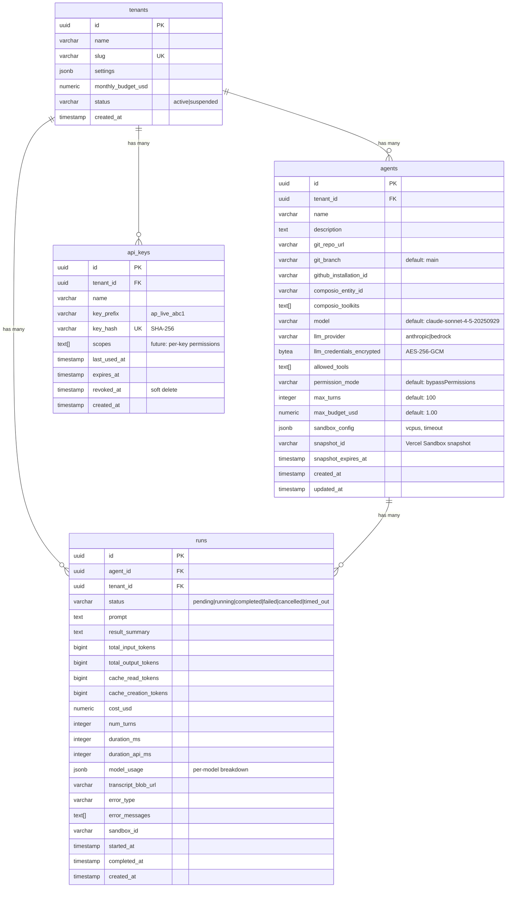

# AgentPlane - Claude Agent-as-a-Service on Vercel

## Enhancement Summary

**Deepened on:** 2026-02-15
**Research agents used:** 18 (6 research + 11 review + 1 skill)

### Critical Issues Found (Must Fix Before Implementation)

1. **RLS with Neon pooled connections** -- `SET LOCAL` works within transactions via the `Pool` (WebSocket) driver, but the HTTP `neon()` driver cannot maintain transaction state. All tenant-scoped queries must use `Pool`, not `neon()`.
2. **TOCTOU race on concurrent run limit** -- The check-then-insert pattern for the 10-run cap is bypassable under concurrent load. Use atomic `INSERT ... WHERE (SELECT COUNT(*)) < 10` or advisory locks.
3. **Transcript memory accumulation** -- API route accumulating full transcripts in memory risks OOM at moderate concurrency. Sandbox should always write to file; API route should relay bytes without buffering.
4. **Sandbox-to-platform callbacks unauthenticated** -- For detached runs (>5 min), the sandbox calls back to update status and upload transcripts with no auth. Generate run-scoped JWT tokens.
5. **`bypassPermissions` as default** -- Dangerous default permission mode. Consider `default` as default, with `bypassPermissions` as opt-in.
6. **Single encryption key with no rotation** -- Store key version alongside ciphertext. Support `ENCRYPTION_KEY` + `ENCRYPTION_KEY_PREVIOUS` for rotation.
7. **LLM credentials as sandbox env vars** -- Exfiltrable via `printenv` or process introspection. Inject via stdin/tempfile with immediate deletion, or use the SDK's built-in credential handling.
8. **Missing CHECK constraints and indexes** -- Schema needs explicit `CHECK` constraints on all enum columns, `TIMESTAMPTZ` (not `TIMESTAMP`), `NUMERIC` with precision, and indexes for all query patterns.
9. **No `CRON_SECRET` verification** -- Cron endpoints are unauthenticated. Vercel sends `Authorization: Bearer <CRON_SECRET>` on cron requests.
10. **0/14 agent-native capabilities** -- Platform has no MCP server exposure; agents can't programmatically manage other agents.

### Key Architectural Recommendations

- **Typed query helpers:** `query<T>(schema, sql, params)` with Zod parse-on-read for type-safe raw SQL
- **Branded types:** `TenantId`, `AgentId`, `RunId`, `ApiKeyId` to prevent parameter swaps
- **Tenant-scoped query context:** `withTenantTransaction(tenantId, callback)` using `Pool` + `set_config(_, _, true)`
- **Run status state machine:** Explicit `VALID_TRANSITIONS` map with atomic `UPDATE ... WHERE status = $current`
- **Error hierarchy:** `AppError` base class with `NotFoundError`, `AuthError`, `BudgetExceededError` -- move to Phase 1
- **Repository pattern:** `src/db/repositories/` for tenant-scoped data access to prevent missed WHERE clauses
- **`after()` for transcript upload:** Emit result event before Blob upload, use Next.js `after()` for async persistence
- **Batch pre-run queries into CTE:** Reduce 5 round-trips to 1 for run creation (60-80ms savings)
- **`app_user` Postgres role:** RLS policies apply to this role; superuser connection for migrations only

### YAGNI Cuts (~35% LOC Reduction)

The simplicity review identified 24 items to defer. Key cuts:
- Defer: Vercel KV rate limiting, idempotency keys, GitHub App integration, Composio OAuth flow (Phase 3+)
- Simplify: Hardcode `permission_mode = 'bypassPermissions'`, `vcpus = 2`, `timeout = '10m'` for MVP
- Remove from MVP: `llm_provider`/`llm_credentials_encrypted` (platform key only), `sandbox_config` JSONB, `snapshot_id`/`snapshot_expires_at`, `monthly_budget_usd` (defer billing)

---

## Overview

AgentPlane is a developer-first platform for running Claude Agent SDK agents in the cloud. Developers configure agents with specific tools (via Composio), skills/commands (via Git repos), and runtime settings, then execute them on-demand via API. Full observability into every agent run through real-time NDJSON streaming and stored transcripts.

**Target users:** Developers and engineering teams who want to deploy Claude-powered agents without managing infrastructure.

**Core capabilities (MVP):**
1. **Agent Runtime** -- Execute Claude Agent SDK agents in Vercel Sandboxes with configurable model, max turns, and budget per execution
2. **Plugin Repo** -- Point each agent to a Git repo containing skills, slash commands, and MCP configs. Cloned at sandbox startup, loaded natively by the SDK
3. **Composio Integration** -- Each agent gets a Composio entity for managed tool authentication. Composio generates per-agent MCP URLs exposing authenticated tools
4. **Full Observability** -- Real-time HTTP streaming of agent execution + complete transcript storage

## Problem Statement

Running Claude Agent SDK agents in production requires managing sandboxed execution environments, tool authentication, credential storage, observability, and cost control. Each team building agents today must solve these infrastructure problems independently. AgentPlane provides a managed platform that handles all of this, letting developers focus on agent configuration and prompt engineering.

The team previously built a Cloudflare Workers-based prototype (`feat/cloudflare-agent-infrastructure`) that validated the architecture. This plan pivots to Vercel for better streaming support, purpose-built sandbox isolation (Firecracker microVMs), and simpler deployment as a single Next.js application.

## Proposed Solution

A single Next.js application deployed on Vercel that handles everything:

- **API Routes** -- Control plane (auth, agent config CRUD, run triggering/streaming, run history)
- **Vercel Sandbox** -- Agent execution in ephemeral Firecracker microVMs
- **Neon Postgres** -- Persistent data (tenants, agent configs, run metadata, API keys)
- **Vercel Blob** -- Run transcripts (NDJSON, configurable TTL)

### Why Vercel Over Alternatives

| Approach | Verdict | Reason |
|----------|---------|--------|
| **Vercel monolith (chosen)** | Selected | Simplest deployment, native streaming, purpose-built sandbox, can split later |
| Cloudflare Containers | Rejected | Moving away from CF. Vercel Sandbox has better isolation and native SDK support |
| API + Execution split | Rejected | More infrastructure overhead for MVP. Split if needed later |
| Thin orchestrator | Rejected | Too little control over execution, hard to add rate limiting and queuing |

## Technical Approach

### Architecture

```
Developer (API Client)
    |
    | Authorization: Bearer ap_live_xxx
    |
    v
[Next.js App Router on Vercel]
    |
    +-- Middleware: API key auth (SHA-256 lookup)
    |
    +-- POST /api/tenants          (admin-only: create tenants)
    +-- POST /api/keys             (create API keys)
    +-- CRUD /api/agents           (agent configuration)
    +-- POST /api/runs             (trigger + stream NDJSON)
    +-- GET  /api/runs/:id         (run metadata)
    +-- GET  /api/runs/:id/transcript (download transcript)
    +-- POST /api/runs/:id/cancel  (abort running agent)
    +-- GET  /api/agents/:id/connect/:toolkit (Composio OAuth redirect)
    |
    +-- Neon Postgres (@neondatabase/serverless, raw SQL)
    |     tenants, agents, runs, api_keys
    |
    +-- Vercel Blob
          transcripts/{tenant_id}/{run_id}.ndjson
```

```
[Vercel Sandbox - Firecracker microVM]              [External Services]
    |                                                      |
    +-- Clone git plugin repo (shallow, depth=1)     [Composio]
    +-- Claude Agent SDK query()                       +-- MCP URL per agent entity
    |     - allowedTools, permissionMode                +-- OAuth for GitHub/Slack/etc.
    |     - PreToolUse/PostToolUse hooks               +-- 300+ toolkits
    |     - settingSources: ['project']
    |     - maxBudgetUsd, maxTurns                   [Anthropic API / AWS Bedrock]
    +-- NDJSON events -> stdout -> API route relay      +-- Claude models
    +-- Auto-terminate on completion/timeout
```

**Streaming path:**
```
Client <--NDJSON stream-- API Route <--sandbox.logs()-- Vercel Sandbox
                                                          |
                                                     Claude Agent SDK
                                                     query() async generator
                                                          |
                                                     stdout (JSON per line)
```

### Research Insights: Architecture

**Neon Driver Selection (Critical):**
- Use `Pool` (WebSocket driver) for all tenant-scoped queries -- required for `BEGIN` / `set_config` / `COMMIT` pattern
- Use `neon()` (HTTP driver) only for stateless queries: health checks, API key hash lookups
- `neon()` HTTP driver cannot maintain transaction state -- each call is a separate HTTP request
- Pool config for serverless: `max: 5`, `idleTimeoutMillis: 10_000`, `connectionTimeoutMillis: 10_000`
- Need two connection strings: `DATABASE_URL` (pooled, for app) and `DATABASE_URL_DIRECT` (unpooled, for migrations)

**Internal Domain Boundaries:**
```
src/
  control/     -- tenant mgmt, agent CRUD, key mgmt (reads/writes config)
  execution/   -- sandbox lifecycle, streaming, run management (reads config, writes run data)
  shared/      -- auth, crypto, logging, db helpers, types
```

**Streaming Architecture:**
- Use `pull()` not `start()` for `ReadableStream` -- enables backpressure from slow clients
- Relay raw bytes from sandbox stdout without JSON parse/re-stringify (byte-level relay)
- Use `after()` from `next/server` to upload transcripts after response closes
- `supportsCancellation: true` in `vercel.json` for stream cleanup on disconnect

**Run Status State Machine:**
```typescript
const VALID_TRANSITIONS: Record<RunStatus, RunStatus[]> = {
  pending:   ['running', 'failed'],
  running:   ['completed', 'failed', 'cancelled', 'timed_out'],
  completed: [],
  failed:    [],
  cancelled: [],
  timed_out: [],
};
// Enforce with: UPDATE runs SET status = $new WHERE id = $id AND status = $current
```

**Composio Integration (Updated):**
- `@composio/core@0.6.3` -- v3 API is now default (Feb 2026). Old "entity" concept replaced with `userId`
- Session creation: `composio.create(entityId)` returns `session.mcp.url` + `session.mcp.headers`
- MCP URL format: `https://backend.composio.dev/v3/mcp/...` (not `mcp.composio.dev`)
- Entity-per-agent has zero additional cost (pricing is per tool call, not per entity)
- `verifyWebhook()` is now async and requires `id` + `timestamp` params (SDK 0.6.0 breaking change)
- Network policy must allow `backend.composio.dev` (not `mcp.composio.dev`)
- Composio uses "brokered credentials" -- LLM never sees raw OAuth tokens (security advantage)

**References:**
- [Neon Serverless Driver Docs](https://neon.com/docs/serverless/serverless-driver)
- [Neon Connection Pooling](https://neon.com/docs/connect/connection-pooling)
- [Vercel Streaming Functions](https://vercel.com/docs/functions/streaming-functions)
- [Vercel Backpressure Guide](https://vercel.com/guides/handling-backpressure)
- [Composio MCP Quickstart](https://docs.composio.dev/docs/mcp-quickstart)
- [Composio Migration Guide](https://docs.composio.dev/docs/migration)

### Data Model



### Research Insights: Data Model

**Schema Corrections (Data Integrity Review):**
- Use `TIMESTAMPTZ` not `TIMESTAMP` for all timestamp columns (timezone-aware)
- Use `NUMERIC(10, 6)` with explicit precision for `cost_usd`
- Add `CHECK` constraints on all enum columns (`status`, `llm_provider`, `permission_mode`)
- Add `NOT NULL` on all columns that should never be null
- Add `ON DELETE CASCADE` on all foreign keys referencing `tenants(id)` and `agents(id)`
- Use `FORCE ROW LEVEL SECURITY` (not just `ENABLE`) to prevent table owner bypass
- Scope unique constraints to tenant: `UNIQUE(tenant_id, lower(name))` not `UNIQUE(name)`

**Required Indexes (Performance Review):**
```sql
-- Authentication hot path (implicit from UNIQUE on key_hash)
CREATE INDEX idx_api_keys_active ON api_keys (key_hash) WHERE revoked_at IS NULL;

-- Tenant-scoped queries (tenant_id FIRST in all composites)
CREATE INDEX idx_agents_tenant ON agents (tenant_id);
CREATE INDEX idx_runs_tenant_created ON runs (tenant_id, created_at DESC);
CREATE INDEX idx_runs_tenant_status ON runs (tenant_id, status);
CREATE INDEX idx_runs_agent ON runs (agent_id);

-- Partial index for active runs (budget/concurrency checks)
CREATE INDEX idx_runs_active ON runs (tenant_id) WHERE status IN ('pending', 'running');

-- Budget aggregation covering index
CREATE INDEX idx_runs_tenant_monthly_cost ON runs (tenant_id, created_at) INCLUDE (cost_usd);
```

**RLS Policy Pattern (Neon-Specific):**
```sql
-- Use NULLIF + current_setting(_, true) for fail-closed behavior:
-- If tenant context is unset, no rows are visible (NULL never equals tenant_id)
CREATE POLICY tenant_isolation ON runs
  FOR ALL TO app_user
  USING (tenant_id = NULLIF(current_setting('app.current_tenant_id', true), '')::uuid)
  WITH CHECK (tenant_id = NULLIF(current_setting('app.current_tenant_id', true), '')::uuid);
```

**Application Role (Critical for RLS):**
- Create `app_user` role -- RLS policies apply to this role only
- Superusers bypass RLS entirely -- app must never connect as superuser
- `DATABASE_URL` connects as `app_user`; `DATABASE_URL_DIRECT` connects as superuser (migrations only)

**Composite FK for Referential Integrity:**
```sql
-- Prevent runs from referencing an agent that belongs to a different tenant
ALTER TABLE runs ADD CONSTRAINT fk_runs_agent_tenant
  FOREIGN KEY (agent_id, tenant_id) REFERENCES agents(id, tenant_id);
-- Requires: UNIQUE(id, tenant_id) on agents
```

**References:**
- [Bytebase: Common Postgres RLS Footguns](https://www.bytebase.com/blog/postgres-row-level-security-footguns/)
- [Crunchy Data: Designing Postgres for Multi-Tenancy](https://www.crunchydata.com/blog/designing-your-postgres-database-for-multi-tenancy)
- [AWS: Multi-Tenant Data Isolation with PostgreSQL RLS](https://aws.amazon.com/blogs/database/multi-tenant-data-isolation-with-postgresql-row-level-security/)

### NDJSON Event Schema

Every line in the stream is a self-contained JSON object. Clients switch on `type`:

```typescript
type StreamEvent =
  | { type: 'run_started'; run_id: string; agent_id: string; model: string; timestamp: string }
  | { type: 'system'; session_id: string; tools: string[]; mcp_servers: string[] }
  | { type: 'assistant'; message: { id: string; content: ContentBlock[]; usage: Usage }; uuid: string }
  | { type: 'tool_use'; tool_name: string; tool_input: unknown; uuid: string; timestamp: string }
  | { type: 'tool_result'; tool_name: string; output: string; uuid: string; timestamp: string }
  | { type: 'heartbeat'; timestamp: string }  // every 15s to keep connection alive
  | { type: 'error'; error: string; code?: string; timestamp: string }
  | { type: 'result'; subtype: 'success' | 'error_max_turns' | 'error_max_budget_usd' | 'error_during_execution';
      cost_usd: number; duration_ms: number; num_turns: number; usage: Usage; model_usage: ModelUsage }
```

### Research Insights: NDJSON Streaming

**Missing Event Type:**
- Add `stream_detached` to the `StreamEvent` TypeScript union (currently only described in prose)
- Add `recoverable: boolean` to error events so clients know whether to retry

**Content-Type:**
- Use `application/x-ndjson` (registered IANA media type, supported by Elasticsearch and Ollama)
- Set `Transfer-Encoding: chunked`, `Cache-Control: no-cache, no-transform`, `X-Accel-Buffering: no`

**Heartbeat Implementation:**
- Timer must be in the API route (not dependent on sandbox output)
- During long tool executions (60s Bash), sandbox emits nothing -- heartbeat prevents proxy timeout
- 15s interval is well-chosen: safe for nearly all proxies (nginx default idle timeout is 60s)

**Client-Side NDJSON Consumption:**
- Must handle partial lines split across network chunks (buffer + split on `\n`)
- Use `TextDecoder` with `{ stream: true }` for multi-byte UTF-8 handling
- Implement exponential backoff with jitter (1s base, 30s cap, 0.3 jitter factor) for reconnection
- NDJSON over fetch is correct choice over SSE because POST body and custom headers are needed

**Backpressure (Critical for Scale):**
```typescript
// CORRECT: pull-based (backpressure-aware)
new ReadableStream({
  async pull(controller) {
    const { value, done } = await generator.next();
    if (done) { controller.close(); return; }
    controller.enqueue(encoder.encode(value + '\n'));
  },
  cancel() { generator.return(undefined); }
});

// WRONG: push-based (no backpressure, can OOM)
new ReadableStream({
  async start(controller) {
    for await (const value of generator) {
      controller.enqueue(encoder.encode(value + '\n')); // unbounded buffer!
    }
  }
});
```

**References:**
- [Vercel Streaming Functions](https://vercel.com/docs/functions/streaming-functions)
- [MDN ReadableStream](https://developer.mozilla.org/en-US/docs/Web/API/ReadableStream)
- [Backpressure in JavaScript Streams](https://blog.gaborkoos.com/posts/2026-01-06-Backpressure-in-JavaScript-the-Hidden-Force-Behind-Streams-Fetch-and-Async-Code/)

### API Key Design (Stripe Pattern)

```
Format:  ap_live_<32 random bytes base62-encoded>
Example: ap_live_sk7Kj2mNpQrS4tUvWxYz1234567890ab

Prefix:    ap_live_ (identifiable, enables secret scanning)
Entropy:   32 bytes (256 bits, brute-force resistant)
Storage:   SHA-256 hash in Postgres (fast lookup, no bcrypt needed for high-entropy keys)
Display:   Show raw key only once at creation. After: show prefix only (ap_live_sk7K...)
Rotation:  Multiple keys per tenant, revoke old + create new
```

### Research Insights: API Key Auth

**Key Generation (Web Crypto, Edge-compatible):**
```typescript
const bytes = new Uint8Array(32);
crypto.getRandomValues(bytes);
const raw = 'ap_live_' + base62Encode(bytes); // 43 base62 chars
const hash = await crypto.subtle.digest('SHA-256', new TextEncoder().encode(raw));
const keyHash = Array.from(new Uint8Array(hash)).map(b => b.toString(16).padStart(2, '0')).join('');
```

**Two-Layer Auth Pattern:**
1. **Middleware (Edge, O(1)):** Validate `Bearer` header presence, `ap_live_` prefix, length bounds. No DB call.
2. **Route handler (Node.js, O(log n)):** SHA-256 hash + `WHERE key_hash = $hash` with B-tree index.

**Why SHA-256, Not bcrypt:** API keys have 256 bits of entropy (brute-force resistant). SHA-256 is O(microseconds) vs bcrypt O(100ms). bcrypt is for low-entropy passwords, not high-entropy keys.

**Timing-Safe Comparison NOT Needed:** Hash-then-lookup reveals nothing via timing. The DB query time correlates with index depth, not hash match quality. Timing-safe comparison IS needed for `ADMIN_API_KEY` (direct string comparison).

**Key Prefix Benefits:**
- Secret scanning detection (register with GitHub's Secret Scanning Partner Program)
- Human identification (`ap_live_` = AgentPlane production key)
- O(1) rejection of malformed keys before any crypto work
- Future extensibility: `ap_test_`, `ap_admin_`, `ap_pub_`

**Rate Limiting (Sliding Window):**
```typescript
// Atomic sliding window via Redis sorted sets
const pipeline = kv.pipeline();
pipeline.zremrangebyscore(key, 0, windowStart); // remove expired
pipeline.zadd(key, { score: now, member: `${now}:${Math.random()}` });
pipeline.zcard(key);
pipeline.expire(key, windowSeconds);
const [, , count] = await pipeline.exec();
```

**References:**
- [Semgrep: Prefixed Secrets](https://semgrep.dev/blog/2025/secrets-story-and-prefixed-secrets/)
- [Timing-Safe Auth with Web Crypto](https://www.arun.blog/timing-safe-auth-web-crypto/)
- [DreamFactory: Rate Limiting in Multi-Tenant APIs](https://blog.dreamfactory.com/rate-limiting-in-multi-tenant-apis-key-strategies/)

### Tenant Onboarding

MVP uses admin-provisioned tenants (no self-service signup):

```bash
# Admin CLI (scripts/create-tenant.ts)
npx tsx scripts/create-tenant.ts --name "Acme Corp" --slug acme --budget 100

# Output:
# Tenant created: acme (id: 550e8400-...)
# API Key: ap_live_sk7Kj2mNpQrS4tUvWxYz1234567890ab
# ⚠️  Save this key - it cannot be shown again
```

Post-MVP: self-service signup with email verification + Stripe billing.

### Agent Execution Flow (Detailed)

```
1. Client: POST /api/runs { agent_id, prompt }
   Headers: Authorization: Bearer ap_live_xxx
            Content-Type: application/json
            Idempotency-Key: <optional UUID>

2. API Route:
   a. Authenticate (SHA-256 hash lookup in api_keys)
   b. Load agent config from Postgres
   c. Check tenant budget (monthly spend vs monthly_budget_usd)
   d. Check concurrent run limit (max 10 per tenant)
   e. Check idempotency key (if provided, return existing run)
   f. Create run record (status: pending)

3. API Route -> Vercel Sandbox:
   a. Create sandbox: Sandbox.create({
        runtime: 'node22',
        resources: { vcpus: agent.sandbox_config.vcpus || 2 },
        timeout: ms(agent.sandbox_config.timeout || '10m'),
        source: agent.snapshot_id
          ? { type: 'snapshot', snapshotId: agent.snapshot_id }
          : agent.git_repo_url
            ? { type: 'git', url: agent.git_repo_url, depth: 1,
                password: await getGitHubInstallationToken(agent.github_installation_id),
                revision: agent.git_branch || 'main' }
            : undefined,
      })
   b. Install Claude Agent SDK (if not from snapshot)
   c. Write runner script to sandbox
   d. Update run record (status: running, sandbox_id)

4. Sandbox Execution:
   a. Runner script calls query() with agent config
   b. SDK emits messages as JSON lines to stdout
   c. API route reads via sandbox.logs() in detached mode
   d. API route relays each line as NDJSON to client
   e. API route accumulates transcript in memory

5. Completion:
   a. SDK emits result message (cost, tokens, duration)
   b. Persist transcript to Vercel Blob
   c. Update run record (status, cost, tokens, duration, transcript_blob_url)
   d. sandbox.stop()
   e. Close HTTP response
```

### Streaming Timeout Strategy

**Problem:** Vercel serverless functions have a max execution time of 300s (Pro). Agent runs can last up to 30+ minutes.

**Solution:** Hybrid streaming + polling:

| Run Duration | Strategy |
|---|---|
| < 5 min | Direct NDJSON streaming via held-open HTTP connection |
| > 5 min | Stream for 4.5 min, then emit `{ type: 'stream_detached', poll_url: '/api/runs/{id}' }` and close. Client polls for status + reads transcript after completion |

The sandbox continues running independently of the API route. Transcript accumulation happens inside the sandbox (written to a file), then uploaded to Blob on completion via a separate lightweight API call.

For runs > 5 min, the runner script inside the sandbox handles its own transcript persistence:

```typescript
// Inside sandbox: write transcript to file as events arrive
for await (const message of query({ ... })) {
  appendFileSync('/tmp/transcript.ndjson', JSON.stringify(message) + '\n');
  console.log(JSON.stringify(message)); // relay to API route while connected
}
// On completion: upload transcript
await uploadTranscript(runId, '/tmp/transcript.ndjson');
await updateRunStatus(runId, result);
```

### Research Insights: Execution Flow

**Atomic Concurrent Run Check (Fixes TOCTOU):**
```sql
-- Single atomic statement replaces check-then-insert
INSERT INTO runs (id, agent_id, tenant_id, status, prompt, created_at)
SELECT $1, $2, $3, 'pending', $4, NOW()
WHERE (SELECT COUNT(*) FROM runs WHERE tenant_id = $3 AND status IN ('pending', 'running')) < 10
RETURNING id;
-- If no row returned, limit was hit
```

**Batch Pre-Run Queries (CTE, 1 round-trip instead of 5):**
```sql
WITH auth AS (
  SELECT tenant_id FROM api_keys WHERE key_hash = $1 AND revoked_at IS NULL
), agent AS (
  SELECT * FROM agents WHERE id = $2 AND tenant_id = (SELECT tenant_id FROM auth)
), budget AS (
  SELECT COALESCE(SUM(cost_usd), 0) as spent FROM runs
  WHERE tenant_id = (SELECT tenant_id FROM auth) AND created_at >= date_trunc('month', NOW())
), concurrent AS (
  SELECT COUNT(*) as active FROM runs
  WHERE tenant_id = (SELECT tenant_id FROM auth) AND status IN ('pending', 'running')
)
SELECT auth.tenant_id, agent.*, budget.spent, concurrent.active
FROM auth, agent, budget, concurrent;
```

**Sandbox Environment Variables (Vercel Sandbox SDK):**
- Env vars are per-command (`runCommand`), NOT per-sandbox
- `sandbox.commands.run({ cmd: 'node runner.js', env: { ... } })`
- Snapshots expire after 7 days and auto-stop the sandbox
- `sandbox.logs()` is on the `Command` class (detached mode)
- Use `Sandbox.get(sandboxId)` to reconnect to a running sandbox

**Transcript Persistence (Recommended Pattern):**
1. Sandbox ALWAYS writes to `/tmp/transcript.ndjson` (all runs, not just long ones)
2. API route relays bytes to client WITHOUT buffering the full transcript
3. On completion, sandbox uploads to Blob via lightweight callback
4. API route uses `after()` to update run record after response closes

**References:**
- [Vercel Sandbox SDK Reference](https://vercel.com/docs/vercel-sandbox/sdk-reference)
- [Next.js `after()` API](https://nextjs.org/docs/app/api-reference/functions/after)

### Budget Enforcement (Multi-Layer)

| Layer | Mechanism | When |
|---|---|---|
| **Per-run** | SDK `maxBudgetUsd` + `maxTurns` | During execution (SDK-enforced) |
| **Per-tenant pre-check** | Compare monthly spend vs `monthly_budget_usd` | Before run starts |
| **Per-tenant concurrent** | Max 10 concurrent runs | Before sandbox creation |
| **Alert thresholds** | Log warnings at 50%, 80%, 95% of monthly budget | After each run completes |

### Research Insights: Budget Enforcement

**Monthly Spend Counter (Performance Fix):**
- `SUM(cost_usd) WHERE created_at >= date_trunc('month', NOW())` scans all runs per month
- At 10,000 runs/month: 5-10ms. At 100,000 runs: 30-50ms per query
- **Recommendation:** Maintain `current_month_spend` column on `tenants` table, updated atomically on run completion
- Pre-check becomes single-row lookup: `SELECT monthly_budget_usd, current_month_spend FROM tenants WHERE id = $1`
- Reset via monthly cron or `spend_period_start` timestamp

**TOCTOU on Budget Check:**
- Same race as concurrent run check -- two runs can both pass the budget check
- Use `SELECT ... FOR UPDATE` on tenant row within the transaction for serialization

### Security Model

**Tenant Isolation (Defense-in-Depth):**

1. **Application layer:** Every query includes `WHERE tenant_id = $1`. Centralized in a tenant-scoped query helper.
2. **Database layer:** Postgres Row-Level Security (RLS) as safety net:
   ```sql
   ALTER TABLE runs ENABLE ROW LEVEL SECURITY;
   CREATE POLICY tenant_isolation ON runs
     USING (tenant_id = current_setting('app.current_tenant_id')::uuid);
   ```
3. **Sandbox layer:** Each run is in its own Firecracker microVM. Zero shared state between tenants.
4. **Network layer:** Sandbox egress restricted to allowed domains:
   ```typescript
   networkPolicy: {
     allow: ['api.anthropic.com', 'backend.composio.dev', '*.githubusercontent.com']
   }
   ```

**Credential Security:**
- LLM credentials encrypted at rest with AES-256-GCM using a platform-managed key (`ENCRYPTION_KEY` env var)
- Decrypted only at sandbox startup, injected as environment variables
- Never logged, never included in transcripts (SDK hooks can redact)

**Prompt Injection Mitigation:**
- Git repos are developer-controlled (not end-user input), reducing but not eliminating risk
- SDK `permissionMode` and `allowedTools` constrain what the agent can do regardless of prompt
- PostToolUse hooks log all tool calls for audit
- Future: static analysis of plugin repos before loading

**Learnings from Cloudflare Implementation** (17 documented issues):
- Always validate tenant ownership on every resource access (todo-003)
- Never derive security boundaries from email domains (todo-007)
- Use runtime validation for all external data, not just TypeScript types (todo-011)
- Single-flight pattern for OAuth refresh to prevent race conditions (todo-009)
- Never swallow errors silently -- log everything with context (todo-014)
- Cascade deletes when removing tenants to prevent orphaned data (todo-016)
- Pin to commit SHAs for plugin repos in production (future enhancement)

### Research Insights: Security

**Critical Security Issues (Security Sentinel):**

| # | Issue | Severity | Fix |
|---|---|---|---|
| C1 | Single encryption key, no versioning | Critical | Store `{ version, iv, ciphertext }`. Support `ENCRYPTION_KEY_PREVIOUS` for rotation |
| C2 | `bypassPermissions` as default | Critical | Default to `default` or `acceptEdits`. Require explicit opt-in for bypass |
| C3 | LLM credentials injected as sandbox env vars | Critical | Exfiltrable via `printenv`. Use stdin injection or SDK credential handling |
| C4 | No auth on cron endpoints | High | Verify `Authorization: Bearer <CRON_SECRET>` header on all cron routes |
| C5 | Sandbox-to-platform callbacks unauthenticated | High | Generate run-scoped JWT: `{ run_id, tenant_id, exp: sandbox_timeout + buffer }` |
| H1 | Prompt injection via git repos underestimated | High | Git repos can contain `.claude/` configs that override agent settings. Pin to commit SHAs |
| H2 | TOCTOU race on budget enforcement | High | Serialize with `SELECT ... FOR UPDATE` on tenant row |
| H3 | Transcript Blob URLs potentially public | Medium | Use signed URLs with short TTL, not direct Blob URLs |

**RLS Footguns to Avoid:**
1. **Table owner bypasses RLS** -- use `FORCE ROW LEVEL SECURITY` on all tables
2. **Missing `WITH CHECK`** -- allows cross-tenant INSERT without `WITH CHECK` clause
3. **Testing as superuser hides RLS bugs** -- integration tests must connect as `app_user`
4. **Global unique constraints leak data** -- scope unique indexes to `(tenant_id, ...)`
5. **Materialized views bypass RLS** -- don't use for tenant data
6. **Non-LEAKPROOF functions prevent index use** -- RLS policies should only use `current_setting` (already LEAKPROOF)

**Sandbox Network Policy Update:**
```typescript
networkPolicy: {
  allow: ['api.anthropic.com', 'backend.composio.dev', '*.githubusercontent.com']
  // NOT mcp.composio.dev (deprecated)
}
```

**Vercel Environment Scoping:**
- `ENCRYPTION_KEY`, `DATABASE_URL`, `ADMIN_API_KEY`, `GITHUB_APP_PRIVATE_KEY` -- production-only
- Preview deployments should use separate Neon branches and test keys

### Research Insights: TypeScript Patterns

**Typed Query Helper (P0):**
```typescript
import { z, ZodSchema } from 'zod';

async function query<T>(schema: ZodSchema<T>, sql: string, params: unknown[]): Promise<T[]> {
  const { rows } = await pool.query(sql, params);
  return rows.map(row => schema.parse(row)); // Runtime validation on every DB read
}
```

**Tenant-Scoped Query Context (P0):**
```typescript
async function withTenantTransaction<T>(
  tenantId: string,
  fn: (client: PoolClient) => Promise<T>
): Promise<T> {
  const client = await pool.connect();
  try {
    await client.query('BEGIN');
    await client.query("SELECT set_config('app.current_tenant_id', $1, true)", [tenantId]);
    const result = await fn(client);
    await client.query('COMMIT');
    return result;
  } catch (err) {
    await client.query('ROLLBACK');
    throw err;
  } finally {
    client.release();
  }
}
```

**Branded Types (P1):**
```typescript
type TenantId = string & { readonly __brand: 'TenantId' };
type AgentId = string & { readonly __brand: 'AgentId' };
type RunId = string & { readonly __brand: 'RunId' };
```

**Error Hierarchy (Move to Phase 1):**
```typescript
class AppError extends Error {
  constructor(public code: string, public statusCode: number, message: string) { super(message); }
}
class NotFoundError extends AppError { constructor(msg: string) { super('not_found', 404, msg); } }
class AuthError extends AppError { constructor(msg: string) { super('unauthorized', 401, msg); } }
class BudgetExceededError extends AppError { constructor(msg: string) { super('budget_exceeded', 403, msg); } }
```

**Env Validation at Startup:**
```typescript
const EnvSchema = z.object({
  DATABASE_URL: z.string().url(),
  ENCRYPTION_KEY: z.string().length(64), // 32 bytes hex
  ADMIN_API_KEY: z.string().startsWith('ap_'),
  COMPOSIO_API_KEY: z.string().min(1),
});
export const env = EnvSchema.parse(process.env);
```

**AsyncLocalStorage for Request Context:**
```typescript
import { AsyncLocalStorage } from 'node:async_hooks';
interface RequestContext { requestId: string; tenantId: string; runId?: string; }
export const requestContext = new AsyncLocalStorage<RequestContext>();
```

### Implementation Phases

#### Phase 1: Foundation (Core Platform)

**Goal:** Tenant management, API key auth, agent CRUD -- the control plane without execution.

**Tasks:**
- [x] Initialize Next.js 15 project with App Router, TypeScript strict mode
- [x] Set up Neon serverless driver (`@neondatabase/serverless`) with raw SQL
- [x] Define database schema as SQL migration files
  - `src/db/migrations/001_initial.sql` -- tables: tenants, api_keys, agents, runs
  - `src/db/migrate.ts` -- migration runner script
  - Enable Row-Level Security on all tenant-scoped tables
- [x] Implement API key authentication middleware
  - `src/lib/auth.ts` -- SHA-256 hash lookup, tenant context injection
  - `src/middleware.ts` -- protect `/api/*` routes (except health)
- [x] Implement tenant management
  - `scripts/create-tenant.ts` -- admin CLI for tenant provisioning
  - `POST /api/keys` -- create additional API keys
  - `DELETE /api/keys/:id` -- revoke a key
- [x] Implement agent CRUD API routes
  - `app/api/agents/route.ts` -- POST (create), GET (list)
  - `app/api/agents/[agentId]/route.ts` -- GET, PUT, DELETE
  - `src/lib/validation.ts` -- Zod schemas for agent config validation
- [x] Set up structured logging
  - `src/lib/logger.ts` -- JSON output with tenant_id, run_id context
- [x] Health check endpoint
  - `app/api/health/route.ts` -- checks Neon Postgres connectivity
- [x] Set up Vitest with test utilities
  - `vitest.config.ts` -- path aliases, coverage
  - `tests/helpers/` -- mock factories for tenants, agents, API keys
- [x] Unit tests for auth, validation, CRUD operations

**Files:**
```
app/
  api/
    health/route.ts
    agents/route.ts
    agents/[agentId]/route.ts
    keys/route.ts
    keys/[keyId]/route.ts
src/
  db/
    index.ts               (Neon pool + sql tagged template helper)
    migrations/
      001_initial.sql
    migrate.ts             (migration runner)
  lib/
    auth.ts
    validation.ts
    logger.ts
    errors.ts
    crypto.ts              (API key generation, credential encryption)
scripts/
  create-tenant.ts
middleware.ts
vitest.config.ts
```

**Research Insights: Phase 1 Additions**

- [ ] Create `app_user` Postgres role and grant permissions (RLS applies to this role only)
- [ ] Add `src/lib/errors.ts` with error hierarchy (AppError, NotFoundError, etc.) in Phase 1, not Phase 4
- [ ] Add `src/db/repositories/` for tenant-scoped data access (tenants.ts, agents.ts, runs.ts, api-keys.ts)
- [ ] Add env validation with Zod at startup (`src/lib/env.ts`)
- [ ] Health check must verify Neon + Blob + KV, not just Postgres. Return `{ status, checks: { postgres, blob, kv } }`
- [x] Health check endpoint must be excluded from auth middleware (currently middleware protects all `/api/*`)
- [ ] Add `vercel.json` with cron job definitions and function config
- [ ] Add `DATABASE_URL_DIRECT` env var for migrations (unpooled connection)
- [ ] Add `CRON_SECRET` env var for cron endpoint authentication
- [ ] Snake_case/camelCase mapping convention: database = `snake_case`, API responses = `snake_case`, TypeScript internals = `camelCase`
- [ ] Document admin auth mechanism (dedicated `ADMIN_API_KEY` env var with timing-safe comparison)

**Success Criteria:**
- [ ] Can create a tenant via CLI and receive an API key
- [ ] Can authenticate with API key and perform agent CRUD
- [ ] Invalid/missing/revoked keys return 401
- [ ] Cross-tenant access blocked by RLS
- [ ] All operations have structured log output

#### Phase 2: Agent Execution Engine

**Goal:** Execute Claude Agent SDK inside Vercel Sandbox with real-time NDJSON streaming.

**Tasks:**
- [x] Implement sandbox lifecycle management
  - `src/lib/sandbox.ts` -- create, configure, execute, cleanup
  - Git repo cloning via `source.type: 'git'`
  - Environment variable injection (LLM credentials, Composio config)
  - Snapshot creation and reuse for faster cold starts
- [x] Implement the in-sandbox runner script builder
  - `src/lib/runner.ts` -- generates the Node.js script that runs inside the sandbox
  - Configures `query()` with agent settings (model, tools, permissions, hooks)
  - Emits structured NDJSON to stdout
  - Handles transcript file accumulation for long runs
- [x] Implement the streaming API route
  - `app/api/runs/route.ts` -- POST handler that creates sandbox and streams NDJSON
  - `ReadableStream` response with `application/x-ndjson` content type
  - `export const dynamic = 'force-dynamic'` and `export const maxDuration = 300`
  - Heartbeat events every 15s to keep connection alive
  - Stream detachment for runs > 4.5 min
- [x] Implement run lifecycle management
  - `src/lib/runs.ts` -- create run record, update status, record cost
  - Status state machine: `pending -> running -> completed|failed|cancelled|timed_out`
  - Pre-run budget check (tenant monthly spend vs limit)
  - Pre-run concurrent run check (max 10 per tenant)
  - Post-run cost recording from `SDKResultMessage`
- [x] Implement run cancellation
  - `app/api/runs/[runId]/cancel/route.ts` -- POST handler
  - Calls `sandbox.stop()` and updates run status to `cancelled`
- [x] Implement transcript persistence
  - `src/lib/transcripts.ts` -- upload NDJSON to Vercel Blob
  - In-sandbox fallback: sandbox writes transcript file, uploads on completion
- [x] Run history API routes
  - `app/api/runs/route.ts` -- GET handler with pagination, filtering
  - `app/api/runs/[runId]/route.ts` -- GET run details
  - `app/api/runs/[runId]/transcript/route.ts` -- GET transcript from Blob
- [ ] Integration tests
  - End-to-end: create agent -> trigger run -> receive stream -> verify transcript
  - Timeout handling, budget enforcement, cancellation

**Files:**
```
app/api/
  runs/route.ts
  runs/[runId]/route.ts
  runs/[runId]/cancel/route.ts
  runs/[runId]/transcript/route.ts
src/lib/
  sandbox.ts
  runner.ts
  runs.ts
  transcripts.ts
  budget.ts
tests/
  integration/
    execution.test.ts
  unit/
    sandbox.test.ts
    runner.test.ts
    runs.test.ts
    budget.test.ts
```

**Research Insights: Phase 2 Additions**

- [ ] Use pull-based `ReadableStream` (not push-based) for backpressure handling
- [ ] Relay raw bytes from sandbox without JSON parse/re-stringify
- [ ] Always write transcript to file inside sandbox (all runs, not just long ones)
- [ ] Use `after()` from `next/server` to persist transcript after response closes
- [ ] Add `stream_detached` to TypeScript `StreamEvent` union
- [ ] Implement atomic concurrent run check (INSERT...WHERE subquery, not check-then-insert)
- [ ] Implement run status state machine with valid transition map
- [ ] Generate run-scoped JWT for sandbox-to-platform callbacks (detached runs)
- [ ] Add `supportsCancellation: true` in `vercel.json` for stream cleanup
- [ ] Decompose runs route handler into service layer: `execution-service.ts`, `streaming-service.ts`, `budget-service.ts`

**Success Criteria:**
- [ ] Can trigger an agent run and receive real-time NDJSON stream
- [ ] Run completes and transcript is persisted to Blob
- [ ] Run metadata (cost, tokens, duration) accurately recorded
- [ ] Budget enforcement prevents runs when tenant over limit
- [ ] Cancellation stops sandbox and records partial transcript
- [ ] Runs > 5 min detach gracefully with poll URL

#### Phase 3: Tool Integration (Composio + GitHub)

**Goal:** Enable agents to use external tools via Composio MCP and load plugins from Git repos.

**Tasks:**
- [x] Implement Composio integration
  - `src/lib/composio.ts` -- entity creation, MCP session management
  - `@composio/core` SDK for entity lifecycle (not deprecated `mcp.composio.dev`)
  - Entity-per-agent model (not per-tenant)
- [x] Implement Composio OAuth connection flow
  - `app/api/agents/[agentId]/connect/[toolkit]/route.ts` -- GET redirects to Composio OAuth
  - `app/api/agents/[agentId]/connect/callback/route.ts` -- OAuth callback handler
  - Store connection status on agent record
- [x] Implement GitHub App integration
  - `src/lib/github.ts` -- installation token generation for private repo cloning
  - `app/api/github/webhook/route.ts` -- handle installation events
  - Store `github_installation_id` on agent record
- [x] MCP server configuration builder
  - `src/lib/mcp.ts` -- builds MCP config object for SDK from agent config
  - Merges Composio MCP server with repo-defined `.mcp.json` servers
  - Domain allowlisting for MCP servers
- [ ] Test Composio tool execution end-to-end
  - Agent with GitHub toolkit creates a real GitHub issue
  - Agent with Slack toolkit sends a real message (test workspace)

**Files:**
```
app/api/
  agents/[agentId]/connect/[toolkit]/route.ts
  agents/[agentId]/connect/callback/route.ts
  github/webhook/route.ts
src/lib/
  composio.ts
  github.ts
  mcp.ts
```

**Research Insights: Phase 3 Composio Integration**

**Session-Based MCP URL (Recommended):**
```typescript
const composio = new Composio({ apiKey: process.env.COMPOSIO_API_KEY });
const session = await composio.create(agentEntityId);
// session.mcp.url = 'https://backend.composio.dev/v3/mcp/...'
// session.mcp.headers includes API key automatically
```

**Passing to Claude Agent SDK:**
```typescript
const options: Options = {
  mcpServers: {
    composio: { type: 'http', url: session.mcp.url, headers: session.mcp.headers },
  },
  env: { ENABLE_TOOL_SEARCH: 'auto' }, // Activates when tools exceed 10% of context
};
```

**Entity ID Convention:**
```typescript
function generateComposioEntityId(tenantSlug: string, agentId: string): string {
  return `ap_${tenantSlug}_${agentId}`;
}
// Entity is created implicitly on first composio.create() call -- no explicit API needed
```

**OAuth Connection Flow (Updated for v3 API):**
```typescript
const connRequest = await composio.connectedAccounts.initiate(entityId, authConfigId, { callbackUrl });
// connRequest.redirectUrl -> redirect user
// On callback: verify connection status via composio.connectedAccounts.get(connectedAccountId)
```

**Webhook for Connection Expiry (Feb 2026 feature):**
- Subscribe to `composio.connected_account.expired` via Webhook Subscriptions API
- Signature verification: `composio.verifyWebhook(body, { signature, timestamp, id })`
- Use to proactively notify users when OAuth tokens expire

**Composio Pricing (per tool call, not per entity):**
| Plan | Price | Tool Calls/Month |
|---|---|---|
| Hobby | $0 | 20,000 |
| Starter | $29/mo | 200,000 |
| Growth | $229/mo | 2,000,000 |

**Success Criteria:**
- [ ] Developer can connect GitHub/Slack toolkits to an agent via OAuth flow
- [ ] Agent runs can use Composio-provided tools (verified with real API calls)
- [ ] Private GitHub repos are cloned successfully via GitHub App installation tokens
- [ ] MCP configs from git repos are merged with Composio MCP server

#### Phase 4: Polish & Hardening

**Goal:** Production readiness -- error handling, cleanup, documentation, operational tooling.

**Tasks:**
- [x] Implement transcript cleanup cron
  - `app/api/cron/cleanup-transcripts/route.ts` -- delete expired Blob entries
  - Vercel Cron Job config in `vercel.json`
  - Configurable TTL per tenant (default 30 days)
- [x] Implement orphaned sandbox cleanup
  - `app/api/cron/cleanup-sandboxes/route.ts` -- find runs stuck in `running` > 6 hours, mark failed
- [x] Implement rate limiting
  - Per-tenant: 60 requests/minute on control plane, 10 concurrent runs
  - Per-IP: 10 auth failures/minute (brute-force protection)
  - Use Vercel KV (Redis) for rate limit state
- [x] Implement idempotency for POST /runs
  - `Idempotency-Key` header support
  - Store in Vercel KV with 24h TTL
- [x] Error handling standardization
  - `src/lib/errors.ts` -- error classes with HTTP status codes and machine-readable codes
  - Consistent error response format across all endpoints
  - Graceful handling of external service failures (Composio, GitHub, Anthropic)
- [ ] API documentation
  - OpenAPI spec or README with curl examples for every endpoint
- [x] Vercel deployment configuration
  - `vercel.json` -- cron jobs, function config, environment variables
  - Environment variable documentation
- [ ] Snapshot optimization
  - After first successful run, create sandbox snapshot for agent
  - Refresh snapshots on git repo update or 7-day expiry
- [ ] Monitoring and alerting
  - Structured logs for all operations (already in Phase 1)
  - Budget alert thresholds (50%, 80%, 95%)
  - Error rate monitoring via log analysis

**Files:**
```
app/api/cron/
  cleanup-transcripts/route.ts
  cleanup-sandboxes/route.ts
src/lib/
  rate-limit.ts
  idempotency.ts
vercel.json
```

**Research Insights: Phase 4 Additions**

- [ ] Verify `CRON_SECRET` on all cron endpoints: `if (request.headers.get('authorization') !== 'Bearer ' + process.env.CRON_SECRET) return 401`
- [ ] Add idempotency protection on cron jobs via KV lock: `SET cron:cleanup:lock EX 1800 NX`
- [ ] Reduce sandbox stuck threshold from 6 hours to `timeout + 30 minutes` (6h is too generous for 10m default)
- [ ] Implement KV fail-open strategy: if KV unreachable, allow request but log warning
- [ ] Add rate limit response headers: `X-RateLimit-Limit`, `X-RateLimit-Remaining`, `X-RateLimit-Reset`, `Retry-After`
- [ ] Use sliding window algorithm (not fixed window) to prevent burst-at-boundary attacks
- [ ] Implement circuit breaker for external services (Composio, GitHub) to prevent cascading latency
- [ ] Add `GITHUB_APP_WEBHOOK_SECRET` to env vars
- [ ] Store `GITHUB_APP_PRIVATE_KEY` as base64-encoded string, decode at runtime
- [ ] Eager snapshot creation at agent creation/update time (not after first run)
- [ ] Build "platform base" snapshot with Node.js + Claude Agent SDK pre-installed
- [ ] Transcript cleanup must paginate (cursor-based iteration across multiple cron runs)
- [ ] Consider API versioning: `/api/v1/*` prefix or document strategy

**Success Criteria:**
- [ ] Expired transcripts are automatically cleaned up
- [ ] Orphaned sandboxes are detected and cleaned
- [ ] Rate limiting prevents abuse
- [ ] Idempotent run creation prevents duplicates
- [ ] All error scenarios return clear, actionable error messages
- [ ] Platform can be deployed to Vercel with documented env vars

## Acceptance Criteria

### Functional Requirements

- [ ] Admin can create tenants via CLI and receive API keys
- [ ] Developers can authenticate with API keys (Bearer token)
- [ ] Developers can CRUD agent configurations
- [ ] Developers can trigger agent runs and receive real-time NDJSON streaming
- [ ] Agents execute in isolated Vercel Sandboxes with configured model, tools, and permissions
- [ ] Agents can load skills/commands from Git repos (public and private via GitHub App)
- [ ] Agents can use Composio-provided tools (GitHub, Slack, etc.) via MCP
- [ ] Run history and transcripts are queryable via API
- [ ] Runs can be cancelled mid-execution
- [ ] Budget enforcement prevents runs when tenant is over limit
- [ ] Long-running agents (> 5 min) degrade gracefully to polling

### Non-Functional Requirements

- [ ] API response time < 200ms for control plane (CRUD) operations
- [ ] Sandbox cold start < 10s (< 3s with snapshots)
- [ ] NDJSON stream latency < 500ms (event emitted -> client received)
- [ ] Supports 100 concurrent runs across all tenants (Vercel Pro baseline)
- [ ] Zero cross-tenant data leakage (RLS + application checks)
- [ ] LLM credentials encrypted at rest (AES-256-GCM)
- [ ] API keys use 256-bit entropy with SHA-256 hashing

### Quality Gates

- [ ] Unit test coverage > 80% for core modules (auth, validation, budget, runs)
- [ ] Integration tests for full execution flow (create agent -> run -> stream -> transcript)
- [ ] All SQL queries parameterized (no string interpolation)
- [ ] Runtime validation (Zod) on all external input (API requests, SDK responses)
- [ ] Structured logging on all operations with correlation IDs (run_id, tenant_id)

## Dependencies & Prerequisites

### Vercel Account & Services
- Vercel Pro plan (required for 300s function timeout, 2000 concurrent sandboxes)
- Vercel Blob store provisioned
- Vercel KV provisioned (for rate limiting + idempotency)

### Neon
- Neon project provisioned (free tier sufficient for MVP)
- Connection string (`DATABASE_URL`) configured

### External Services
- **Anthropic API key** -- for direct API access (platform-level key for admin testing)
- **Composio account** -- Starter or Growth plan ($29-$229/mo) for MCP tool hosting
- **GitHub App** -- created in GitHub settings for private repo cloning

### Environment Variables
```
# Neon
DATABASE_URL                # Neon pooled connection string (connects as app_user)
DATABASE_URL_DIRECT         # Neon direct connection string (for migrations, superuser)

# Vercel (auto-provisioned)
BLOB_READ_WRITE_TOKEN
KV_REST_API_URL
KV_REST_API_TOKEN
CRON_SECRET                 # Vercel cron job authentication

# Platform
ENCRYPTION_KEY              # 32-byte hex for AES-256-GCM credential encryption
ENCRYPTION_KEY_PREVIOUS     # Previous key for rotation (optional)
ADMIN_API_KEY               # For tenant provisioning endpoints (ap_admin_ prefix)

# External Services
COMPOSIO_API_KEY            # Composio platform API key
GITHUB_APP_ID               # GitHub App ID
GITHUB_APP_PRIVATE_KEY      # GitHub App private key (base64-encoded PEM)
GITHUB_APP_WEBHOOK_SECRET   # GitHub webhook signature verification

# Optional (for platform admin testing)
ANTHROPIC_API_KEY           # Platform-level Anthropic key
```

### Research Insights: Deployment

**Blocking Issues (Deployment Verification Review):**

| # | Issue | Severity |
|---|---|---|
| 1 | RLS `SET` commands require `Pool` driver (not `neon()` HTTP) | Critical |
| 2 | No migration state tracking table or runner logic | High |
| 3 | No down migration files for rollback | High |
| 4 | `CRON_SECRET` missing from environment variable list | High |
| 5 | No `vercel.json` exists | High |
| 6 | Health check blocked by auth middleware | High |
| 7 | Sandbox callback authentication not designed | High |

**Required `vercel.json`:**
```json
{
  "crons": [
    { "path": "/api/cron/cleanup-transcripts", "schedule": "0 3 * * *" },
    { "path": "/api/cron/cleanup-sandboxes", "schedule": "*/15 * * * *" }
  ],
  "functions": {
    "app/api/runs/**": { "supportsCancellation": true }
  }
}
```

**Migration Rollback Strategy:**
- Create Neon branch as backup before each migration: `neonctl branches create --name pre-migration-001`
- Wrap each migration in a transaction (Postgres supports transactional DDL)
- Track checksums to detect post-apply modification of migration files
- Add down migration files (`001_initial.down.sql`)

**Zero-Downtime Deployment (Post-Initial):**
- Add column (nullable): Safe. Deploy migration, then code.
- Add column (NOT NULL with default): Safe in Postgres 11+.
- Drop column: UNSAFE. Deploy code that stops reading first, then drop.
- Add index: Use `CREATE INDEX CONCURRENTLY` (requires direct/unpooled connection).

**Scalability Projections:**

| Metric | MVP (Month 1) | Growth (Month 6) | Scale (Month 12) |
|--------|--------------|-------------------|-------------------|
| Tenants | 5-10 | 50-100 | 500+ |
| Agents | 20-50 | 200-500 | 2,000+ |
| Runs/day | 50-200 | 2,000-10,000 | 50,000+ |
| Runs table rows | 5,000 | 200,000 | 2,000,000+ |
| Concurrent runs (peak) | 5-10 | 30-50 | 100-200 |

### Research Insights: Agent-Native Gaps

**Current Score: 12/20 capabilities accessible (60%)**

**Missing API Endpoints (Spec Flow Analysis):**
- `GET /api/keys` -- list keys for authenticated tenant
- `GET /api/tenants/me` -- get current tenant info
- `POST /api/tenants` -- programmatic tenant provisioning (currently CLI-only)
- Agent connection status endpoint (which toolkits are connected?)
- `callback_url` parameter on `POST /api/runs` for async completion notification

**Future Agent-Native Enhancements:**
- Expose AgentPlane control plane as MCP server (agents managing other agents)
- Per-run capability overrides (`allowed_tools`, `max_budget_usd` per run, not just per agent)
- Agent-to-agent communication (currently blocked by sandbox network policy)
- Persistent agent memory across runs (context injection)
- Shared workspaces between agents

## Risk Analysis & Mitigation

| Risk | Severity | Likelihood | Mitigation |
|------|----------|------------|------------|
| Vercel function timeout (300s) blocks long runs | High | High | Hybrid streaming + polling. Sandbox runs independently of API route. |
| Composio deprecating `mcp.composio.dev` | Medium | Confirmed | Already using `@composio/core` SDK (not deprecated endpoint) |
| Vercel Sandbox API changes (newer product) | Medium | Medium | Pin SDK version. Abstract sandbox operations behind `src/lib/sandbox.ts` |
| Prompt injection via malicious Git repo contents | Medium | Low | SDK `allowedTools` constrains actions. Repos are developer-controlled. Add static analysis later |
| Runaway agent costs | High | Medium | Multi-layer budget enforcement (SDK maxBudgetUsd + tenant monthly limit + concurrent run cap) |
| Secret exposure in transcripts | Medium | Medium | PostToolUse hooks can redact sensitive values. Document which tools may expose secrets |
| Vercel Sandbox cold start for complex repos | Low | Medium | Snapshots reduce repeat cold starts to < 3s. Shallow clone (depth=1) for git source |
| Composio outage blocks all tool-using agents | Medium | Low | Agents without Composio tools still function. Log Composio errors clearly |
| GitHub outage blocks repo cloning | Medium | Low | Snapshots bypass git clone for subsequent runs. Stale snapshot better than no run |

## Agent Configuration Defaults & Validation

| Field | Required | Default | Validation |
|---|---|---|---|
| `name` | Yes | -- | 1-100 chars |
| `model` | No | `claude-sonnet-4-5-20250929` | Must be valid Claude model ID |
| `llm_provider` | No | `anthropic` | `anthropic` or `bedrock` |
| `git_repo_url` | No | -- | Valid HTTPS GitHub URL |
| `git_branch` | No | `main` | Non-empty string |
| `composio_toolkits` | No | `[]` | Array of valid toolkit names |
| `allowed_tools` | No | `["Read", "Edit", "Write", "Glob", "Grep", "Bash", "WebSearch"]` | Array of tool name strings |
| `permission_mode` | No | `bypassPermissions` | `default`, `acceptEdits`, `bypassPermissions`, `plan` |
| `max_turns` | No | `100` | 1-1000 |
| `max_budget_usd` | No | `1.00` | 0.01-100.00 |
| `sandbox_config.vcpus` | No | `2` | 1, 2, 4, or 8 |
| `sandbox_config.timeout` | No | `10m` | 1m-5h (string parseable by `ms()`) |

## Error Handling for External Dependencies

| Service | Failure Mode | User Impact | Handling |
|---|---|---|---|
| **Anthropic API** | 429 (rate limit), 503, 529 (overloaded) | SDK retries automatically. If persistent, run fails | Run status: `failed`, error_type: `llm_error`. Error in NDJSON stream |
| **Composio** | MCP URL generation fails, OAuth expired | Agent runs without external tools | Run continues with reduced capabilities. Error event in stream |
| **GitHub** | Clone fails (404, 403, rate limited) | Agent runs without plugins | If snapshot exists, use it. Otherwise run fails with clear error |
| **Neon Postgres** | Connection timeout | API returns 503 | Retry once, then 503 with structured error |
| **Vercel Blob** | Upload fails | Transcript lost | Retry once. If still fails, log error. Run metadata still in Postgres |
| **Vercel Sandbox** | Creation fails (capacity) | Run cannot start | Run status: `failed`, error_type: `sandbox_error`. 503 to client |

## Future Considerations

**Post-MVP features (not in this plan):**
- **Triggers:** Webhooks, cron jobs, Composio event subscriptions ("new GitHub issue" -> agent runs)
- **Self-service signup:** Email verification + Stripe billing integration
- **Dashboard UI:** Web interface for agent management, run monitoring, cost tracking
- **Per-key scoping:** Read-only keys, agent-scoped keys
- **Multi-turn sessions:** Resumable agent conversations across multiple API calls
- **Plugin marketplace:** Shared/community plugin repos
- **Webhooks for run completion:** Notify clients when async runs finish
- **Team management:** Multiple users per tenant with role-based access

## Technology Stack Summary

| Component | Technology | Version |
|---|---|---|
| Framework | Next.js (App Router) | 15.x |
| Language | TypeScript | 5.x (strict mode) |
| Database Driver | @neondatabase/serverless (raw SQL) | latest |
| Database | Neon Postgres | -- |
| Object Storage | Vercel Blob | -- |
| Cache/Rate Limit | Vercel KV (Redis) | -- |
| Agent Runtime | Vercel Sandbox | latest |
| Agent SDK | @anthropic-ai/claude-agent-sdk | latest |
| Tool Auth | @composio/core | latest |
| Validation | Zod | latest |
| Testing | Vitest | latest |
| Package Manager | npm | -- |

## References & Research

### Internal References
- Brainstorm: `docs/brainstorms/2026-02-14-agent-as-a-service-brainstorm.md`
- Previous Cloudflare plan: `docs/plans/2026-02-01-feat-cloudflare-agent-infrastructure-plan.md` (git history)
- Security learnings: `todos/001-017.md` (git history, 17 documented issues)

### External References
- [Claude Agent SDK TypeScript Reference](https://platform.claude.com/docs/en/agent-sdk/typescript)
- [Claude Agent SDK Hosting Guide](https://platform.claude.com/docs/en/agent-sdk/hosting)
- [Claude Agent SDK Cost Tracking](https://platform.claude.com/docs/en/agent-sdk/cost-tracking)
- [Claude Agent SDK Hooks Guide](https://platform.claude.com/docs/en/agent-sdk/hooks)
- [Claude Agent SDK MCP Guide](https://platform.claude.com/docs/en/agent-sdk/mcp)
- [Vercel Sandbox SDK Reference](https://vercel.com/docs/vercel-sandbox/sdk-reference)
- [Vercel Sandbox + Claude Agent SDK Guide](https://vercel.com/kb/guide/using-vercel-sandbox-claude-agent-sdk)
- [Vercel Coding Agent Platform Template](https://vercel.com/templates/next.js/coding-agent-platform)
- [Vercel Streaming Functions](https://vercel.com/docs/functions/streaming-functions)
- [Vercel Backpressure Guide](https://vercel.com/guides/handling-backpressure)
- [Vercel Function Cancellation](https://vercel.com/docs/functions/functions-api-reference)
- [Composio MCP Quickstart](https://docs.composio.dev/docs/mcp-quickstart)
- [Composio MCP Overview](https://docs.composio.dev/docs/mcp-overview)
- [Composio Authentication Docs](https://docs.composio.dev/docs/authenticating-tools)
- [Composio Migration Guide (v3 API)](https://docs.composio.dev/docs/migration)
- [Composio Connected Accounts](https://docs.composio.dev/docs/connected-accounts)
- [Composio Changelog](https://docs.composio.dev/docs/changelog)
- [Neon Serverless Driver](https://neon.com/docs/serverless/serverless-driver)
- [Neon Connection Pooling](https://neon.com/docs/connect/connection-pooling)
- [Neon Multitenancy Guide](https://neon.com/docs/guides/multitenancy)
- [Bytebase: Common Postgres RLS Footguns](https://www.bytebase.com/blog/postgres-row-level-security-footguns/)
- [Crunchy Data: Designing Postgres for Multi-Tenancy](https://www.crunchydata.com/blog/designing-your-postgres-database-for-multi-tenancy)
- [AWS: Multi-Tenant Data Isolation with PostgreSQL RLS](https://aws.amazon.com/blogs/database/multi-tenant-data-isolation-with-postgresql-row-level-security/)
- [Semgrep: Prefixed Secrets](https://semgrep.dev/blog/2025/secrets-story-and-prefixed-secrets/)
- [Vercel Blob SDK Reference](https://vercel.com/docs/vercel-blob/using-blob-sdk)
- [Next.js Route Handlers](https://nextjs.org/docs/app/api-reference/file-conventions/route)
- [Next.js `after()` API](https://nextjs.org/docs/app/api-reference/functions/after)
