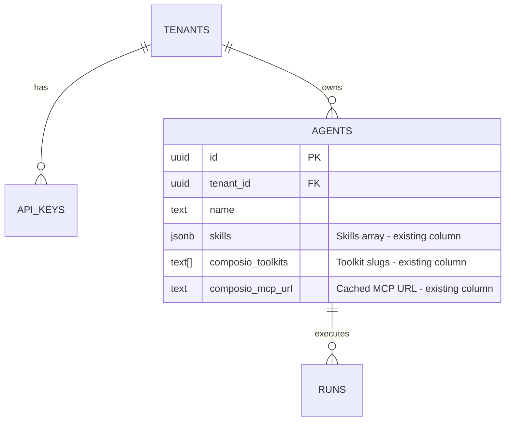

## Enhancement Summary

**Deepened on:** 2026-02-18
**Agents used:** security-sentinel, architecture-strategist, kieran-typescript-reviewer, performance-oracle, code-simplicity-reviewer

### Key Improvements
1. Reduced scope from 7 new endpoints to 4 new + 2 bug fixes (skills handled through existing agent CRUD)
2. Added OAuth CSRF protection via signed state parameter
3. Added middleware exception for unauthenticated callback route
4. Strengthened path traversal validation (allow-list + resolved-path check)
5. Added Composio API performance recommendations (caching, batching)

### New Considerations Discovered
- Cross-tenant credential sharing risk in Composio auth configs
- Middleware will reject unauthenticated callback without explicit exception
- `PUT /api/agents/:agentId` silently drops `skills` (same class of bug as POST)
- Connectors GET makes 3 sequential Composio API calls per toolkit — latency risk

---

# Expose Tenant-Scoped Skills and Connectors Endpoints

## Overview

Add tenant-facing capabilities for managing agent skills and connectors. Skills management is achieved by fixing the existing agent CRUD endpoints (which already accept skills in their schemas but silently drop them). Connectors require 4 new endpoints under `/api/agents/:agentId/connectors/`.

## Problem Statement / Motivation

Tenant API key holders can create agents and trigger runs, but cannot:
- View or update the skills attached to their agents
- See which connectors (Composio toolkits) are connected/pending
- Initiate OAuth flows or save API keys for connectors

This forces all skills/connector management through the admin UI, blocking self-service workflows for tenant client apps.

## Proposed Solution

### Skills: Fix Existing Agent CRUD (no new endpoints)

The existing agent endpoints already handle skills data in their schemas — they just don't persist it. Two bug fixes expose full skills management:

| Endpoint | Fix |
|----------|-----|
| `POST /api/agents` | Add `skills` to INSERT statement |
| `PUT /api/agents/:agentId` | Add `skills` to the PUT handler's field map |

`GET /api/agents/:agentId` already returns `skills` in the response. No new endpoints needed.

> **Research Insight (simplicity review):** Dedicated `/skills` endpoints would duplicate what agent CRUD already supports. The schemas (`CreateAgentSchema`, `UpdateAgentSchema`) already accept skills — the INSERT and UPDATE just silently drop them. One-line fixes in each handler are simpler than 2 new endpoints.

### Connectors: 4 New Endpoints

| Method | Path | Description |
|--------|------|-------------|
| GET | `/api/agents/:agentId/connectors` | List connector statuses |
| POST | `/api/agents/:agentId/connectors` | Save API key for a connector |
| POST | `/api/agents/:agentId/connectors/:toolkit/initiate-oauth` | Start OAuth flow (returns redirect URL as JSON) |
| GET | `/api/agents/:agentId/connectors/:toolkit/callback` | OAuth callback (unauthenticated, popup mode) |

> **Research Insight (simplicity review):** The originally proposed per-toolkit status polling endpoint (`GET /connectors/:toolkit/status`) is cut — clients can use the list endpoint and filter by slug. The list endpoint already calls `getConnectorStatuses()` which returns per-toolkit status.

### OAuth Flow Consolidation

The old `/api/agents/:agentId/connect/:toolkit` flow uses raw REST API calls (`initiateOAuthConnection`). The new `/connectors/` flow uses the Composio SDK (`initiateOAuthConnector`). Consolidate by:
1. Moving old routes to the new `/connectors/` namespace (file rename)
2. Deleting `initiateOAuthConnection` from `composio.ts` (~50 lines), standardizing on `initiateOAuthConnector`
3. No formal deprecation ceremony — just one code path going forward

## Technical Approach

### Extract `getAgentForTenant()` Helper

The agent lookup + tenant check is repeated in 4+ places with subtle variations. Extract to a shared utility before adding more routes.

> **Research Insight (TypeScript review):** The existing local `getAgent` in `agents/[agentId]/route.ts` accepts `string` params, losing branded type safety. The runs route uses a minimal schema `z.object({ id: z.string() })` instead of `AgentRow`. Standardize on a single helper with branded `TenantId`:

```typescript
// src/lib/agents.ts
export async function getAgentForTenant(agentId: string, tenantId: TenantId) {
  const agent = await queryOne(
    AgentRow,
    "SELECT * FROM agents WHERE id = $1 AND tenant_id = $2",
    [agentId, tenantId],
  );
  if (!agent) throw new NotFoundError("Agent not found");
  return agent;
}
```

### Authentication & Authorization

All connector endpoints (except callback) use `authenticateApiKey` + `getAgentForTenant()`:

```typescript
export const GET = withErrorHandler(async (request: NextRequest, context) => {
  const auth = await authenticateApiKey(request.headers.get("authorization"));
  const { agentId } = await context!.params;
  const agent = await getAgentForTenant(agentId, auth.tenantId);
  // ... endpoint logic
});
```

### Connectors Implementation

**GET /api/agents/:agentId/connectors**
- Calls `getConnectorStatuses(tenantId, agent.composio_toolkits)`
- Maps to `TenantConnectorInfo` type — strips internal Composio IDs
- Returns `{ data: TenantConnectorInfo[] }`
- Empty array if no `composio_toolkits` configured
- Use column projection: `SELECT id, tenant_id, composio_toolkits FROM agents` (don't load skills JSONB)

> **Research Insight (TypeScript review):** Create a distinct `TenantConnectorInfo` type in `types.ts`. Don't expose `authConfigId` or `connectedAccountId` — these are Composio implementation details. Map via a pure `toTenantConnectorInfo()` function.

> **Research Insight (pattern review):** Use `{ data: [...] }` envelope to match the convention used by `GET /api/agents` and `GET /api/agents/:id/runs`. The admin endpoint's `{ connectors: [...] }` is the outlier.

```typescript
export interface TenantConnectorInfo {
  slug: string;
  name: string;
  logo: string;
  auth_scheme: string;
  connected: boolean;
}
```

**POST /api/agents/:agentId/connectors**
- Accepts `{ toolkit: string, api_key: string }`
- Validates toolkit is in `agent.composio_toolkits` (400 if not)
- Calls `saveApiKeyConnector(tenantId, toolkit, apiKey)`
- Sanitizes Composio errors before returning (never return raw `err.message`)
- Returns `{ slug, connected: true }`

**POST /api/agents/:agentId/connectors/:toolkit/initiate-oauth**
- Validates toolkit is in `agent.composio_toolkits`
- Generates signed state parameter (JWT with `{agentId, tenantId, toolkit, exp}`) for CSRF protection
- Builds callback URL including state
- Calls `initiateOAuthConnector(tenantId, toolkit, callbackUrl)`
- Returns `{ redirect_url: string }`

**GET /api/agents/:agentId/connectors/:toolkit/callback**
- Unauthenticated (redirect from OAuth provider)
- Validates signed state parameter before processing
- Supports popup mode (`mode=popup`): renders HTML with `postMessage` to opener, then closes
- Supports redirect mode: returns JSON with connection status
- `postMessage` target origin derived from state JWT or hardcoded env var (never from `request.nextUrl.origin`)

### Security Fixes

#### Path Traversal Validation (CRITICAL)

> **Research Insight (security review):** Switch from deny-list to allow-list + resolved-path containment check. The deny-list approach (reject `..`) is fragile — edge cases like URL-encoded variants or null bytes can bypass it.

Fix in `src/lib/validation.ts`:

```typescript
const SafeFolderName = z.string().min(1).max(255).regex(
  /^[a-zA-Z0-9_-]+$/,
  "Folder must be alphanumeric with underscores/hyphens only",
);

const SafeRelativePath = z.string().min(1).max(500).refine(
  (p) => !p.includes("..") && !p.startsWith("/") && !p.includes("\0"),
  { message: "Path must be relative, no '..' segments, no null bytes" },
);
```

Additionally, in `sandbox.ts` at the file-writing step, add a resolved-path containment check as defense-in-depth:

```typescript
const resolved = path.resolve(skillsRoot, folder, filePath);
if (!resolved.startsWith(skillsRoot)) throw new Error("Path escapes skills root");
```

- **Limits**: max 50 skills per agent
- **Total content size**: sum of all `content.length` must be under 5MB (defense beyond Vercel's body limit)

#### OAuth CSRF Protection (CRITICAL)

> **Research Insight (security review):** The callback endpoint is unauthenticated. An attacker could construct a callback URL to bind their OAuth token to a victim's agent. Use a signed state parameter.

When `initiate-oauth` is called:
1. Generate a signed JWT containing `{agentId, tenantId, toolkit, exp: 10min}`
2. Include as `state` query param in the callback URL
3. Callback endpoint verifies JWT signature and expiry before processing

#### Middleware Exception for Callback (CRITICAL — blocks implementation)

> **Research Insight (security review):** The middleware at `src/middleware.ts` checks for `Authorization: Bearer` on all `/api/` routes. The callback endpoint has no Bearer token (it's a redirect from an external OAuth provider). Without an exception, the middleware will reject with 401.

Add a narrow exception:

```typescript
// In middleware.ts
if (pathname.match(/^\/api\/agents\/[^/]+\/connectors\/[^/]+\/callback$/)) {
  return NextResponse.next();
}
```

#### Composio Error Sanitization

Create a utility to map Composio errors to safe messages:

```typescript
function sanitizeComposioError(msg: string): string {
  if (msg.includes("duplicate")) return "Connection already exists";
  if (msg.includes("invalid")) return "Invalid API key format";
  return "Failed to save connector";
}
```

### TypeScript Quality Improvements

> **Research Insight (TypeScript review):**

1. **Fix `skills` in `AgentRow` schema** — Currently uses `z.unknown()` with an `as` cast. Replace with proper Zod schema:
   ```typescript
   skills: z.array(AgentSkillSchema).default([]).catch([]),
   ```

2. **Wrap all handlers in `withErrorHandler`** — Admin connector routes use raw try/catch. New tenant routes must all use `withErrorHandler`.

3. **Don't propagate `context!.params`** — Avoid non-null assertion. Use `RouteContext` type pattern from admin routes.

### Performance Considerations

> **Research Insight (performance review):**

#### Composio API Fan-Out

`getConnectorStatuses()` makes 3 sequential API calls per toolkit (metadata, auth config, connected accounts). For 10 toolkits = 30 external calls, ~600-1200ms.

**Mitigations (implement during this work or immediately after):**

1. **Cache toolkit metadata** — `toolkits.list` and `authConfigs.list` rarely change. Add a 60-120s TTL module-level cache. Eliminates ~66% of Composio calls.

2. **Batch `connectedAccounts.list`** — The API accepts an array of `toolkit_slugs`. Make one call with all slugs instead of N individual calls:
   ```typescript
   const allAccounts = await client.connectedAccounts.list({
     toolkit_slugs: allSlugs,
     user_ids: [tenantId],
     limit: 100,
   });
   ```

3. **Column projection** — `GET /connectors` only needs `tenant_id` and `composio_toolkits` from the agent. Don't `SELECT *` which loads the skills JSONB:
   ```sql
   SELECT id, tenant_id, composio_toolkits FROM agents WHERE id = $1 AND tenant_id = $2
   ```

#### Skills JSONB Size

With 50 skills, Postgres full-column rewrites on every UPDATE create WAL amplification. Acceptable for now. Long-term: consider normalizing to a separate table or moving content to Vercel Blob.

## Acceptance Criteria

### Skills (via existing agent CRUD)
- [ ] `POST /api/agents` persists the `skills` field in INSERT
- [ ] `PUT /api/agents/:agentId` includes `skills` in the field map (with `::jsonb` cast)
- [ ] Skills validation rejects path traversal (`../`, absolute paths, null bytes) via allow-list
- [ ] Skills validation enforces folder name format (`^[a-zA-Z0-9_-]+$`)
- [ ] Skills validation caps at 50 skills, 5MB total content
- [ ] Sandbox file writer includes resolved-path containment check

### Connectors
- [ ] `GET /api/agents/:agentId/connectors` returns `{ data: TenantConnectorInfo[] }` (no internal IDs)
- [ ] `POST /api/agents/:agentId/connectors` saves API key, validates toolkit membership
- [ ] `POST /api/agents/:agentId/connectors/:toolkit/initiate-oauth` returns redirect URL with signed state
- [ ] `GET /api/agents/:agentId/connectors/:toolkit/callback` validates state JWT, handles popup + redirect
- [ ] Toolkit membership validated on POST/initiate-oauth (400 if not in agent config)
- [ ] Composio error messages sanitized before returning to tenant

### Security
- [ ] OAuth callback validates signed state parameter (CSRF protection)
- [ ] Middleware exception added for callback route (narrow pattern match)
- [ ] `postMessage` target origin from env var or state JWT (not `request.nextUrl.origin`)

### Code Quality
- [ ] `getAgentForTenant()` helper extracted to `src/lib/agents.ts`
- [ ] `TenantConnectorInfo` type defined in `src/lib/types.ts`
- [ ] `AgentRow.skills` uses proper Zod schema (not `z.unknown()` cast)
- [ ] All handlers wrapped in `withErrorHandler`
- [ ] Old `/connect/` routes moved to `/connectors/` namespace
- [ ] `initiateOAuthConnection` deleted, standardized on `initiateOAuthConnector`

## Dependencies & Risks

**Dependencies:**
- Existing `getConnectorStatuses()`, `saveApiKeyConnector()`, `initiateOAuthConnector()` in `src/lib/composio.ts` — reused directly
- Existing validation schemas in `src/lib/validation.ts` — extended with path safety
- Admin callback HTML template — mirrored for tenant use

**Risks:**

| Risk | Severity | Mitigation |
|------|----------|------------|
| Cross-tenant credential sharing via shared Composio auth configs | High | Auth configs are shared globally by toolkit. Tenant A's API key could be picked up by Tenant B. Scope auth configs per tenant (include tenantId in name/metadata). Flag for follow-up if not fixed in this PR. |
| Composio downtime | Medium | GET connectors handles per-toolkit failures gracefully. POST/OAuth return 502. Add retry with backoff. |
| Connectors are tenant-scoped, not agent-scoped | Low (by design) | Connecting Gmail through Agent A makes it available on Agent B (same tenant). Document in response or API docs. |
| Skills update during active run | Low | Safe — sandbox already injected old skills. Note: changes take effect on next run. |
| Composio API latency on GET connectors (30+ calls for 10 toolkits) | Medium | Add toolkit metadata cache (60s TTL), batch connectedAccounts call. |

## File Changes Summary

| File | Change |
|------|--------|
| `src/lib/agents.ts` | **New** — `getAgentForTenant()` helper |
| `src/app/api/agents/[agentId]/connectors/route.ts` | **New** — GET list + POST save key |
| `src/app/api/agents/[agentId]/connectors/[toolkit]/initiate-oauth/route.ts` | **New** — POST initiate OAuth (with state JWT) |
| `src/app/api/agents/[agentId]/connectors/[toolkit]/callback/route.ts` | **New** — GET OAuth callback (validates state) |
| `src/lib/types.ts` | **Edit** — add `TenantConnectorInfo`, move `AuthScheme` |
| `src/lib/validation.ts` | **Edit** — `SafeFolderName`, `SafeRelativePath`, skills size limit, fix `AgentRow.skills` schema |
| `src/app/api/agents/route.ts` | **Edit** — add `skills` to INSERT in POST handler |
| `src/app/api/agents/[agentId]/route.ts` | **Edit** — add `skills` to field map in PUT handler |
| `src/lib/sandbox.ts` | **Edit** — add resolved-path containment check |
| `src/middleware.ts` | **Edit** — add narrow exception for connectors callback |
| `src/lib/composio.ts` | **Edit** — add `toTenantConnectorInfo()`, `sanitizeComposioError()`, delete `initiateOAuthConnection` |
| `src/app/api/agents/[agentId]/connect/` | **Move** — rename to `/connectors/` namespace |

## ERD

No database schema changes required.



## References & Research

### Internal References
- Tenant auth pattern: `src/lib/auth.ts:21-66`
- Admin skills update: `src/app/api/admin/agents/[agentId]/route.ts:27-80`
- Admin connectors list: `src/app/api/admin/agents/[agentId]/connectors/route.ts:1-43`
- Admin OAuth initiate: `src/app/api/admin/agents/[agentId]/connectors/[toolkit]/initiate-oauth/route.ts:1-31`
- Admin OAuth callback: `src/app/api/admin/agents/[agentId]/connectors/[toolkit]/callback/route.ts`
- Composio integration: `src/lib/composio.ts` (getConnectorStatuses, saveApiKeyConnector, initiateOAuthConnector)
- Skills validation schema: `src/lib/validation.ts:17-23`
- Skills injection into sandbox: `src/lib/sandbox.ts:75`
- Existing tenant OAuth flow: `src/app/api/agents/[agentId]/connect/`
- Tenant agent CRUD pattern: `src/app/api/agents/[agentId]/route.ts`
- Tenant runs list pattern: `src/app/api/agents/[agentId]/runs/route.ts`
- Middleware route protection: `src/middleware.ts:54-76`
- DB query helpers: `src/db/index.ts:30-96`

### Review Agent Findings
- **Security:** OAuth CSRF via state JWT, path traversal allow-list, middleware callback exception, Composio error sanitization, cross-tenant auth config sharing risk
- **Architecture:** Namespace consistent, PUT correct for skills, consolidate OAuth functions, document tenant-vs-agent connector scoping
- **TypeScript:** Extract `getAgentForTenant()`, create `TenantConnectorInfo`, fix `AgentRow.skills` cast, use `{ data: [...] }` envelope
- **Performance:** Cache Composio metadata (60s TTL), batch connectedAccounts call, column projection, add skills size limit
- **Simplicity:** Drop dedicated skills endpoints (use agent CRUD), drop status polling endpoint, consolidate OAuth flows
