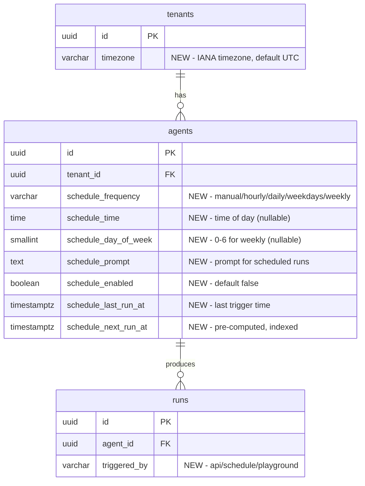

# feat: Add Scheduled Agent Runs

## Enhancement Summary

**Deepened on:** 2026-03-07
**Sections enhanced:** All
**Review agents used:** TypeScript Reviewer, Security Sentinel, Performance Oracle, Architecture Strategist, Data Integrity Guardian, Pattern Recognition Specialist, Code Simplicity Reviewer, Deployment Verification Agent, Best Practices Researcher

### Key Improvements from Deepening
1. **Architecture change**: Move executor endpoint from `/api/internal/` to `/api/cron/scheduled-runs/execute` -- avoids new PUBLIC_PATHS prefix (Security, Architecture, Pattern reviewers unanimous)
2. **Use `FOR UPDATE SKIP LOCKED`** in the claiming query for proper concurrent cron invocation safety (Performance, Best Practices)
3. **Add 4 cross-column CHECK constraints** to enforce schedule data integrity at DB level (Data Integrity)
4. **Use discriminated union** for `ScheduleConfig` type instead of flat positional params (TypeScript)
5. **Use `croner` library** for DST-safe next-run computation instead of hand-rolled Date logic (Best Practices)
6. **Use timing-safe comparison** for CRON_SECRET via shared helper (Security -- CRITICAL)
7. **Limit dispatch concurrency to 10** parallel requests to avoid connection pool exhaustion (Performance)
8. **Extract shared `executeRunInBackground()`** to eliminate 3rd copy of sandbox orchestration (Architecture)
9. **Don't accept `tenant_id`/`prompt` in executor body** -- derive from `agent_id` lookup (Security)
10. **ScheduleEditor receives discrete props** (`agentId`, `initialSchedule`, `timezone`) not full agent (Pattern Recognition)

### Resolved Tensions
- **Two-route vs single-route**: Architecture reviewer correctly notes each POST needs its own Vercel function timeout (runs take minutes). Two-route pattern IS correct for Vercel. Simplicity reviewer's concern about complexity is addressed by keeping both under `/api/cron/`.
- **Batch limit**: Keep a soft limit of 50 with `ORDER BY schedule_next_run_at ASC` for fairness, but dispatch in concurrency-limited batches of 10 (not all 50 at once).
- **`schedule_last_run_at`**: Keep it -- deriving from runs table requires a cross-table query on every cron tick for display, and the atomic UPDATE already sets it for free.

---

## Overview

Allow agents to run automatically on a recurring schedule (Hourly, Daily, Weekdays, Weekly) with a dedicated prompt. A per-minute cron job checks which agents are due and triggers runs via a sibling executor endpoint, reusing all existing run infrastructure.

## Problem Statement / Motivation

Currently, agent runs are only triggered on-demand via the API or admin playground. Users need agents that run automatically on a schedule (e.g., daily reports, weekly summaries, hourly monitoring). This is a core platform capability expected by tenants.

## Proposed Solution

(see brainstorm: `docs/brainstorms/2026-03-07-scheduled-agent-runs-brainstorm.md`)

- **Schedule columns on agents table** -- one schedule per agent, stored as flat columns
- **Pre-computed `schedule_next_run_at`** -- simplifies cron query to a simple timestamp comparison
- **Cron dispatcher** (`/api/cron/scheduled-runs`) running every minute -- claims due agents
- **Cron executor** (`/api/cron/scheduled-runs/execute`) -- runs a single agent in its own function invocation with independent timeout
- **`triggered_by` column on runs table** -- distinguishes scheduled vs API vs playground runs
- **Tenant-level timezone** -- new `timezone` column on tenants table
- **ScheduleEditor component** -- new section on agent detail page between Skills and Runs
- **Shared `executeRunInBackground()`** -- extracted from existing duplicated sandbox orchestration

## Technical Considerations

### Architecture

The dispatcher claims due agents using `FOR UPDATE SKIP LOCKED` for safe concurrent invocations:

```sql
WITH due AS (
  SELECT id
  FROM agents
  WHERE schedule_enabled = true
    AND schedule_next_run_at <= NOW()
  ORDER BY schedule_next_run_at ASC
  LIMIT 50
  FOR UPDATE SKIP LOCKED
)
UPDATE agents
SET schedule_last_run_at = NOW(),
    schedule_next_run_at = NULL  -- computed in app code after RETURNING
FROM due
WHERE agents.id = due.id
RETURNING agents.id, agents.tenant_id, agents.schedule_prompt,
          agents.schedule_frequency, agents.schedule_time,
          agents.schedule_day_of_week;
```

### Research Insights

**Why `FOR UPDATE SKIP LOCKED`:**
- Vercel Cron provides NO built-in overlap protection. If a tick takes >1 minute, the next invocation overlaps.
- `SKIP LOCKED` is non-blocking -- concurrent workers skip locked rows instead of waiting. Perfect for serverless.
- Works with Neon's PgBouncer in transaction mode (unlike session-level advisory locks which do NOT work with Neon pooling).
- Battle-tested pattern used by Solid Queue (37signals), pg-boss, and other production job systems.

**Why two routes (dispatcher + executor):**
- Vercel functions have a `maxDuration` limit (300s default, 800s max on Pro with Fluid Compute).
- A single cron handler processing N agents sequentially would timeout after the first run.
- Each POST to the executor is a separate function invocation with its own timeout budget.
- Independent failure domains: one failed run doesn't abort others.

**Next-run computation:** Use the `croner` library (zero dependencies, TypeScript-native, IANA timezone support) for DST-safe next-run calculation. Store all `schedule_next_run_at` values as UTC `TIMESTAMPTZ`. If the Temporal API is available in the Node.js runtime, prefer `Temporal.ZonedDateTime` for date arithmetic.

```typescript
import { Cron } from 'croner';

function computeNextRunAt(
  config: ScheduleConfig,
  timezone: string,
  fromDate?: Date
): Date | null {
  const cronExpr = scheduleConfigToCron(config);
  if (!cronExpr) return null;
  const job = new Cron(cronExpr, { timezone });
  return job.nextRun(fromDate) ?? null;
}
```

For each returned agent, the dispatcher computes `schedule_next_run_at` in app code (using tenant timezone from a join), then batch-updates the agents, and fires POSTs to the executor in concurrency-limited batches of 10.

The executor endpoint:
1. Authenticates via `CRON_SECRET` (timing-safe comparison)
2. Accepts only `{ agent_id }` -- derives `tenant_id` and `schedule_prompt` from DB lookup
3. Calls `createRun(tenantId, agentId, schedulePrompt, { triggeredBy: 'schedule' })`
4. Calls shared `executeRunInBackground()` for MCP config + sandbox + transcript
5. Returns `200` immediately; `after()` handles the actual execution

### Timezone Handling

Use `croner` with IANA timezone strings for next-run computation. For DST:
- **Spring-forward (gap):** `croner` automatically skips to the next valid time
- **Fall-back (ambiguity):** `croner` runs once on the first occurrence

Validate timezones using `Intl.supportedValuesOf('timeZone')` (Node 18+).

### Batch & Concurrency Limits

- Claim up to 50 agents per tick with `ORDER BY schedule_next_run_at ASC` (oldest first for fairness)
- Dispatch in concurrency-limited batches of 10 to avoid Neon connection pool exhaustion (pool typically 50-100 connections)
- If batch limit is hit, log a warning -- remaining agents picked up on next tick
- Set `export const maxDuration = 300` on both dispatcher and executor

### Error Handling

Per-agent failures (budget exceeded, concurrency limit, suspended tenant) are logged and skipped. `schedule_last_run_at` and `schedule_next_run_at` are updated atomically BEFORE the run is created, so a failed run does not cause a re-trigger storm.

### Research Insights: Error Handling

**Result type for observability:**
```typescript
type ScheduleTriggerResult =
  | { status: "triggered"; runId: RunId }
  | { status: "skipped"; reason: "budget_exceeded" | "concurrency_limit" | "tenant_suspended" }
  | { status: "failed"; error: string };
```

**Stuck job recovery:** Add a reaper check at the start of each cron invocation -- agents where `schedule_next_run_at IS NULL` (claimed but executor never computed next run) should be reset:
```sql
UPDATE agents SET schedule_next_run_at = schedule_last_run_at
WHERE schedule_enabled = true AND schedule_next_run_at IS NULL
  AND schedule_last_run_at < NOW() - INTERVAL '5 minutes';
```

## System-Wide Impact

- **Interaction graph:** Cron dispatcher claims agents -> POSTs to executor -> `createRun()` -> `executeRunInBackground()` -> sandbox creation -> `after()` callback -> transcript persistence + run status transition
- **Error propagation:** Budget/concurrency errors caught per-agent in the executor. Sandbox failures handled by existing `after()` cleanup. Orphaned sandboxes caught by `cleanup-sandboxes` cron (every 15 min).
- **State lifecycle risks:** `FOR UPDATE SKIP LOCKED` prevents double-triggers. If the executor POST fails after the UPDATE, the schedule advances (acceptable -- same as a missed run). Stuck-job reaper provides recovery.
- **API surface parity:** Schedule fields are admin-only initially. Tenant API and SDK are not affected in v1.

### Research Insights: System-Wide Impact

**Existing sandbox orchestration duplication:** The full MCP config + sandbox + transcript pipeline is currently duplicated between `/api/runs/route.ts` (tenant) and `/api/admin/agents/[agentId]/runs/route.ts` (playground). The executor would be a 3rd copy. Extract `executeRunInBackground()` into `src/lib/run-executor.ts` to eliminate this tech debt. The three callers differ only in auth and response format.

## Implementation Phases

### Phase 1: Database Migration (`src/db/migrations/010_add_agent_schedules.sql`)

Add columns to `tenants` table:

```sql
ALTER TABLE tenants ADD COLUMN IF NOT EXISTS timezone VARCHAR(100) NOT NULL DEFAULT 'UTC';
```

Add columns to `agents` table:

```sql
ALTER TABLE agents ADD COLUMN IF NOT EXISTS schedule_frequency VARCHAR(20) DEFAULT 'manual'
  CHECK (schedule_frequency IN ('manual', 'hourly', 'daily', 'weekdays', 'weekly'));
ALTER TABLE agents ADD COLUMN IF NOT EXISTS schedule_time TIME;
ALTER TABLE agents ADD COLUMN IF NOT EXISTS schedule_day_of_week SMALLINT
  CHECK (schedule_day_of_week BETWEEN 0 AND 6);
ALTER TABLE agents ADD COLUMN IF NOT EXISTS schedule_prompt TEXT;
ALTER TABLE agents ADD COLUMN IF NOT EXISTS schedule_enabled BOOLEAN NOT NULL DEFAULT false;
ALTER TABLE agents ADD COLUMN IF NOT EXISTS schedule_last_run_at TIMESTAMPTZ;
ALTER TABLE agents ADD COLUMN IF NOT EXISTS schedule_next_run_at TIMESTAMPTZ;
```

Cross-column constraints (from Data Integrity review):

```sql
ALTER TABLE agents ADD CONSTRAINT chk_schedule_day_of_week_weekly
  CHECK (
    (schedule_frequency = 'weekly' AND schedule_day_of_week IS NOT NULL)
    OR (schedule_frequency != 'weekly' OR schedule_frequency IS NULL)
    AND (schedule_day_of_week IS NULL)
  );

ALTER TABLE agents ADD CONSTRAINT chk_schedule_time_required
  CHECK (
    (schedule_frequency IN ('daily', 'weekdays', 'weekly') AND schedule_time IS NOT NULL)
    OR (schedule_frequency IN ('manual', 'hourly') OR schedule_frequency IS NULL)
  );

ALTER TABLE agents ADD CONSTRAINT chk_schedule_prompt_required
  CHECK (
    schedule_enabled = false
    OR schedule_prompt IS NOT NULL
  );

ALTER TABLE agents ADD CONSTRAINT chk_schedule_enabled_not_manual
  CHECK (
    schedule_enabled = false
    OR schedule_frequency != 'manual'
  );
```

Add column to `runs` table:

```sql
ALTER TABLE runs ADD COLUMN IF NOT EXISTS triggered_by VARCHAR(20) NOT NULL DEFAULT 'api'
  CHECK (triggered_by IN ('api', 'schedule', 'playground'));
```

Add partial index for efficient cron queries:

```sql
CREATE INDEX IF NOT EXISTS idx_agents_schedule_due
  ON agents (schedule_next_run_at)
  WHERE schedule_enabled = true;
```

Rollback SQL (comment block for incident response):

```sql
-- ROLLBACK (manual, forward migration):
-- ALTER TABLE agents DROP CONSTRAINT IF EXISTS chk_schedule_day_of_week_weekly;
-- ALTER TABLE agents DROP CONSTRAINT IF EXISTS chk_schedule_time_required;
-- ALTER TABLE agents DROP CONSTRAINT IF EXISTS chk_schedule_prompt_required;
-- ALTER TABLE agents DROP CONSTRAINT IF EXISTS chk_schedule_enabled_not_manual;
-- ALTER TABLE agents DROP COLUMN IF EXISTS schedule_frequency, schedule_time, schedule_day_of_week, schedule_prompt, schedule_enabled, schedule_last_run_at, schedule_next_run_at;
-- ALTER TABLE tenants DROP COLUMN IF EXISTS timezone;
-- ALTER TABLE runs DROP COLUMN IF EXISTS triggered_by;
-- DROP INDEX IF EXISTS idx_agents_schedule_due;
```

### Research Insights: Migration Safety

- All `ADD COLUMN` operations with non-volatile defaults are metadata-only in Postgres 11+ (Neon). No table rewrite, no lock concerns.
- `CREATE INDEX` (non-CONCURRENTLY) takes a brief `ACCESS EXCLUSIVE` lock. Acceptable if agents table is small (<10K rows). Split to `CREATE INDEX CONCURRENTLY` in a separate migration if table is large.
- The `triggered_by DEFAULT 'api'` on existing runs is semantically correct and safe.

### Phase 2: Shared Run Executor & Types

**New file `src/lib/run-executor.ts`:**
- Extract `executeRunInBackground(run, agent, options?)` from the duplicated sandbox orchestration in `/api/runs/route.ts` and `/api/admin/agents/[agentId]/runs/route.ts`
- Encapsulates: MCP config build, plugin fetch, sandbox creation, status transition to running, event streaming/capture, transcript persistence, final status transition, sandbox cleanup
- Three callers pass different options (stream response vs fire-and-forget, auth context)

**New file `src/lib/schedule.ts`:**

```typescript
import { Cron } from 'croner';

// Discriminated union -- makes invalid states unrepresentable
type ScheduleConfig =
  | { frequency: "manual" }
  | { frequency: "hourly" }
  | { frequency: "daily"; time: string }
  | { frequency: "weekdays"; time: string }
  | { frequency: "weekly"; time: string; dayOfWeek: number };

function computeNextRunAt(
  config: ScheduleConfig,
  timezone: string,
  fromDate?: Date
): Date | null;

function scheduleConfigToCron(config: ScheduleConfig): string | null;

function isValidTimezone(tz: string): boolean;
// Uses Intl.supportedValuesOf('timeZone') -- one-liner, no library needed
```

**`src/lib/validation.ts`:**
- Define Zod schemas as source of truth:
  ```typescript
  const ScheduleFrequencySchema = z.enum(["manual", "hourly", "daily", "weekdays", "weekly"]);
  const RunTriggeredBySchema = z.enum(["api", "schedule", "playground"]);
  const TimezoneSchema = z.string().refine(isValidTimezone, { message: "Invalid IANA timezone" });
  ```
- Add schedule fields to `AgentRow` / `AgentRowInternal` schemas
- Add schedule fields to `UpdateAgentSchema`
- Add `triggered_by` to `RunRow` schema
- Add timezone to tenant schemas

**`src/lib/types.ts`:**
- Derive types from Zod: `type ScheduleFrequency = z.infer<typeof ScheduleFrequencySchema>`
- Add `ScheduleConfig` discriminated union
- Add `ScheduleTriggerResult` result type

**`src/lib/runs.ts` (`createRun`):**
- Add options object parameter: `createRun(tenantId, agentId, prompt, { triggeredBy?: RunTriggeredBy })`
- Include `triggered_by` in the INSERT statement

### Research Insights: Type Safety

- Use `as const satisfies` for the fieldMap to catch schema/map mismatches at compile time
- Validate DB returns from the CAS query with a Zod schema -- don't trust raw query results
- The discriminated union for `ScheduleConfig` pays dividends in both `computeNextRunAt` (exhaustive switch) and the PATCH handler (conditional field validation)

### Phase 3: API Changes

**New shared helper `src/lib/cron-auth.ts`:**
```typescript
import { timingSafeEqual } from '@/lib/crypto';

export function verifyCronSecret(request: NextRequest): void {
  const cronSecret = process.env.CRON_SECRET;
  const authHeader = request.headers.get("authorization");
  if (!cronSecret || !authHeader || !timingSafeEqual(authHeader, `Bearer ${cronSecret}`)) {
    throw new ApiError(401, "Unauthorized");
  }
}
```
Also update the 3 existing cron handlers to use this shared helper (fixes existing timing-safe vulnerability).

**`src/app/api/admin/agents/[agentId]/route.ts` (PATCH handler):**
- Add schedule fields to `fieldMap`
- When schedule fields change, compute and set `schedule_next_run_at` using `computeNextRunAt()`
- Cross-column validation enforced by DB constraints + Zod refine

**`src/app/api/admin/tenants/[tenantId]/route.ts` (PATCH handler):**
- Add `timezone` to the updateable fields with `TimezoneSchema` validation

**`src/app/api/runs/route.ts` and `src/app/api/admin/agents/[agentId]/runs/route.ts`:**
- Pass `triggered_by: 'api'` or `triggered_by: 'playground'` to `createRun()`
- Refactor to use shared `executeRunInBackground()`

**New: `src/app/api/cron/scheduled-runs/route.ts` (dispatcher):**
- GET handler following existing cron pattern
- Auth via shared `verifyCronSecret()`
- `export const maxDuration = 300`
- Stuck-job reaper query (reset agents with NULL `schedule_next_run_at` older than 5 min)
- Atomic claim with `FOR UPDATE SKIP LOCKED`, `ORDER BY schedule_next_run_at ASC`, `LIMIT 50`
- Join with tenants for timezone
- Compute `schedule_next_run_at` in app code, batch-update agents
- Dispatch to executor in concurrency-limited batches of 10 via `Promise.allSettled()`
- Log results: `{ triggered: N, failed: N, skipped: N, backlog: N }`
- After dispatch, check remaining due agents and log warning if backlog exists

**New: `src/app/api/cron/scheduled-runs/execute/route.ts` (executor):**
- POST handler, auth via shared `verifyCronSecret()`
- `export const maxDuration = 300`
- Accepts only `{ agent_id }` -- derives `tenant_id` and `schedule_prompt` from DB lookup
- Calls `createRun(tenantId, agentId, schedulePrompt, { triggeredBy: 'schedule' })`
- Calls `executeRunInBackground()` inside `after()`
- Returns `200` immediately
- Never logs prompt content (security)

**`vercel.json`:**
- Add cron entry: `{ "path": "/api/cron/scheduled-runs", "schedule": "* * * * *" }`

**`src/middleware.ts`:**
- NO changes needed. Both new routes are under `/api/cron/` which is already in `PUBLIC_PATHS`.

### Phase 4: Admin UI

**New: `src/app/admin/(dashboard)/agents/[agentId]/schedule-editor.tsx`:**

Client component receiving discrete props (following SkillsEditor/PluginsManager pattern):

```typescript
interface ScheduleEditorProps {
  agentId: string;
  initialSchedule: {
    frequency: string;
    time: string | null;
    dayOfWeek: number | null;
    prompt: string | null;
    enabled: boolean;
    lastRunAt: string | null;
    nextRunAt: string | null;
  };
  timezone: string;
}
```

Layout:

```
+--------------------------------------------------+
| Schedule                                [Toggle] |
+--------------------------------------------------+
| Frequency: [  Weekly          v ]                |
|                                                  |
| Time:      [ 09:00 AM ]                         |
|                                                  |
| Day:       [  Monday          v ]  (Weekly only) |
|                                                  |
| Prompt:                                          |
| +----------------------------------------------+ |
| | Generate a weekly summary report of all...   | |
| +----------------------------------------------+ |
|                                                  |
| Last run: Mar 3, 2026, 9:00 AM EST              |
| Next run: Mar 10, 2026, 9:00 AM EST             |
|                                                  |
|                              [ Save Schedule ]   |
+--------------------------------------------------+
```

- Frequency dropdown: Manual, Hourly, Daily, Weekdays, Weekly
- Time picker: shown for Daily, Weekdays, Weekly (12-hour format with AM/PM)
- Day dropdown: shown only for Weekly (Monday-Sunday)
- Prompt: textarea (required when enabled, max 100,000 chars)
- Toggle: enable/disable without losing config
- Status: last run time + next run time (displayed in tenant timezone with TZ label)
- Save button: PATCH to `/api/admin/agents/${agentId}`
- `isDirty` check comparing current state to initial props
- Follows dark mode pattern (`.dark` class on layout root)
- Uses Card/CardHeader/CardTitle/CardContent UI primitives

**`src/app/admin/(dashboard)/agents/[agentId]/page.tsx`:**
- Import and render `<ScheduleEditor>` between `<SkillsEditor>` and the Runs section
- Pass discrete props: `agentId`, `initialSchedule`, `timezone`

**`src/app/admin/(dashboard)/tenants/[tenantId]/page.tsx`:**
- Add timezone dropdown to tenant edit form (IANA timezone list from `Intl.supportedValuesOf('timeZone')`)

### Phase 5: Runs Table Enhancement

**`src/app/admin/(dashboard)/runs/` and agent detail runs section:**
- Add "Source" column showing triggered_by badge (API / Schedule / Playground)
- Filter option by triggered_by

### Phase 6: New Dependency

**`package.json`:**
- Add `croner` (zero dependencies, ~5KB) for cron expression parsing and timezone-aware next-run computation

## Acceptance Criteria

- [x] Admin can configure a schedule on any agent (frequency, time, day, prompt, enable/disable)
- [x] Schedules respect tenant timezone setting
- [x] Cron job triggers runs for due agents every minute
- [x] Scheduled runs appear in the runs table with `triggered_by: 'schedule'`
- [x] Double-triggers are prevented by `FOR UPDATE SKIP LOCKED` pattern
- [x] Budget-exceeded and concurrency-limit errors are handled gracefully (skip + log)
- [x] Schedule section shows last run time and next run time in tenant timezone
- [x] Dispatch concurrency limited to 10 parallel requests
- [x] Tenant timezone is configurable on the tenant detail page
- [x] Admin playground runs show `triggered_by: 'playground'`
- [x] API-created runs show `triggered_by: 'api'`
- [x] CRON_SECRET compared with timing-safe equality in all handlers
- [x] Cross-column DB constraints enforce schedule data integrity
- [x] Shared `executeRunInBackground()` eliminates sandbox orchestration duplication

## Security Checklist

- [x] No blanket `/api/internal/` in PUBLIC_PATHS -- routes stay under `/api/cron/`
- [x] `CRON_SECRET` compared with `timingSafeEqual()` via shared `verifyCronSecret()` helper
- [x] `CRON_SECRET` null-checked before comparison
- [x] Executor accepts only `agent_id` -- `tenant_id` and `prompt` derived from DB
- [x] `schedule_prompt` length-limited (max 100,000 chars via Zod)
- [x] `RETURNING` uses explicit column list, never `*`
- [x] Cron handler never logs prompt content
- [x] Invalid timezone wrapped in try/catch per-tenant in cron (doesn't crash batch)
- [x] Existing 3 cron handlers updated to use shared `verifyCronSecret()`

## Success Metrics

- Scheduled runs fire within 1-2 minutes of their configured time
- Zero double-triggers in production
- Schedule configuration is intuitive (no support tickets about timezone confusion)

## Dependencies & Risks

| Risk | Impact | Mitigation |
|---|---|---|
| Vercel Cron cold start delays | Runs fire 1-2 min late | Acceptable; pre-computed `next_run_at` ensures eventual trigger |
| Overlapping cron invocations | Double-triggers | `FOR UPDATE SKIP LOCKED` -- concurrent workers skip locked rows |
| Connection pool exhaustion | DB errors under load | Dispatch concurrency limited to 10; Neon pool typically 50-100 |
| Sandbox quota exhaustion | Scheduled runs fail | Batch limit of 50; per-agent error handling; backlog logging |
| DST transitions | Missed or double runs | `croner` library handles DST gaps/overlaps correctly |
| Budget exhaustion | Runs silently fail each schedule | Log warnings; future: add admin notifications |
| Executor POST failure after claim | Missed run | Stuck-job reaper resets agents with NULL `schedule_next_run_at` after 5 min |

## Deployment Checklist

### Pre-Deploy
- [ ] Verify agents table row count (`SELECT COUNT(*) FROM agents`) -- if >10K, split index creation
- [ ] Run migration against staging DB
- [ ] Verify `CRON_SECRET` is set in production env

### Post-Deploy (within 5 min)
- [ ] Verify new columns: `SELECT column_name FROM information_schema.columns WHERE table_name = 'agents' AND column_name LIKE 'schedule%'`
- [ ] Verify index: `SELECT indexname FROM pg_indexes WHERE tablename = 'agents' AND indexname LIKE '%schedule%'`
- [ ] Verify cron responds: `curl -H "Authorization: Bearer $CRON_SECRET" https://<domain>/api/cron/scheduled-runs`
- [ ] Verify no unexpected runs created

### Rollback
1. Revert commit on main (removes cron from vercel.json, removes route handlers)
2. Vercel auto-deploys revert -- cron stops, routes gone
3. New columns remain inert in DB (no action needed)

## ERD Changes



## Sources & References

- **Origin brainstorm:** [docs/brainstorms/2026-03-07-scheduled-agent-runs-brainstorm.md](docs/brainstorms/2026-03-07-scheduled-agent-runs-brainstorm.md) -- Key decisions: columns on agents table, dedicated prompt, tenant-level timezone, cron every minute
- Agent edit form: `src/app/admin/(dashboard)/agents/[agentId]/edit-form.tsx`
- Agent PATCH handler: `src/app/api/admin/agents/[agentId]/route.ts:29-102`
- Run creation: `src/lib/runs.ts:25-81`
- Cron patterns: `src/app/api/cron/budget-reset/route.ts`, `cleanup-sandboxes/route.ts`, `cleanup-transcripts/route.ts`
- Admin playground run: `src/app/api/admin/agents/[agentId]/runs/route.ts`
- Middleware public paths: `src/middleware.ts:6`
- Validation schemas: `src/lib/validation.ts:194-208`
- Vercel cron config: `vercel.json`
- [Vercel Cron Jobs Documentation](https://vercel.com/docs/cron-jobs)
- [Vercel Functions Duration](https://vercel.com/docs/functions/configuring-functions/duration)
- [Next.js after() API](https://nextjs.org/docs/app/api-reference/functions/after)
- [Neon Queue System with SKIP LOCKED](https://neon.com/guides/queue-system)
- [JavaScript Temporal API](https://isitdev.com/javascript-temporal-api-2025-fixing-dates/)
- [croner -- zero-dependency cron scheduler](https://www.npmjs.com/package/croner)
